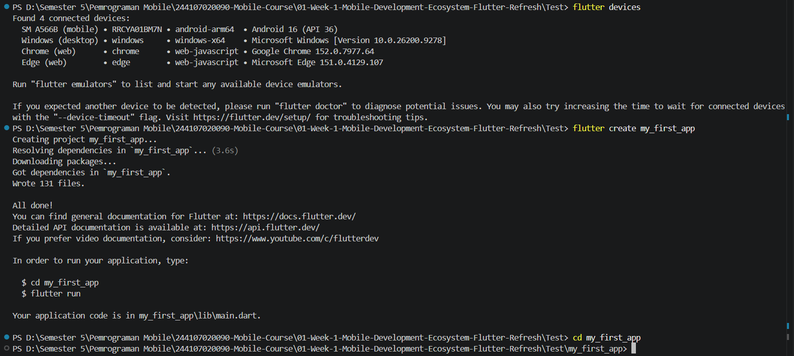
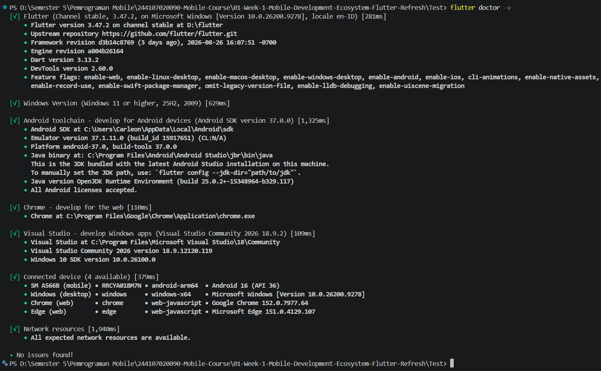
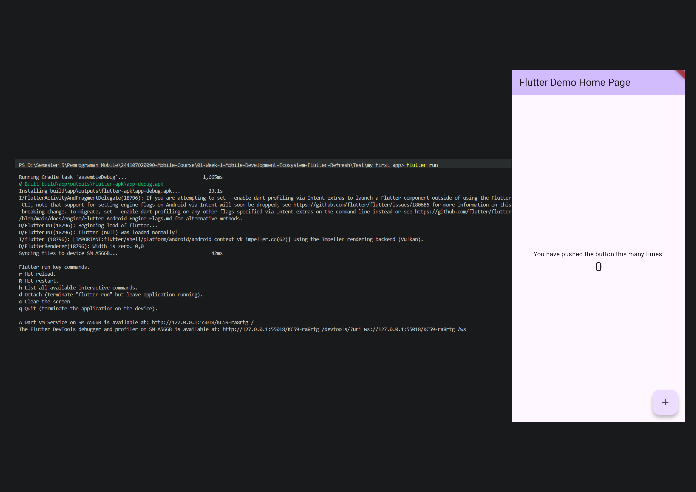
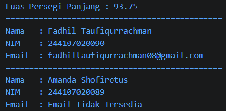
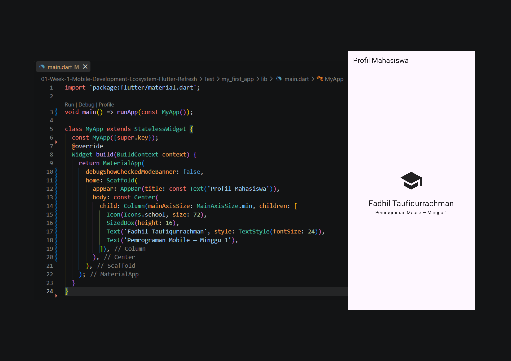
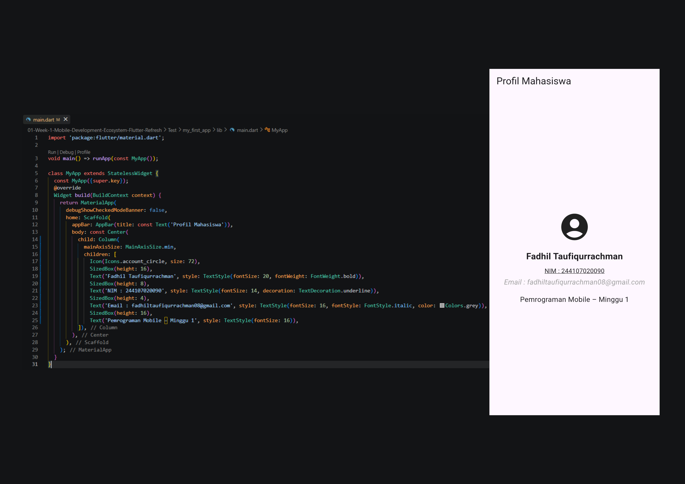
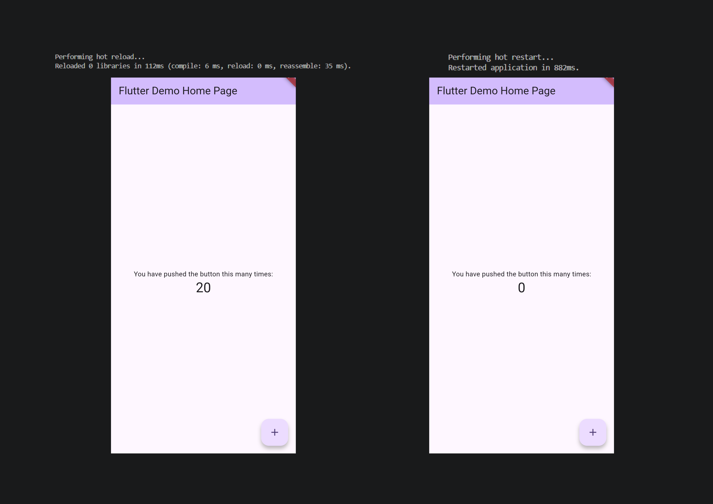

# Minggu 1 — Mobile Development Ecosystem & Flutter Refresh

> Dokumentasi Praktikum Mata Kuliah **Pemrograman Mobile**.

[](https://dart.dev/)
[](https://flutter.dev/)
[](https://docs.flutter.dev/)
[](https://git-scm.com/)

## 🧭 Ringkasan

Folder ini berisi pekerjaan minggu pertama yang berfokus pada pengenalan ekosistem pengembangan aplikasi mobile, pembelajaran konsep dasar Dart, persiapan environment Flutter, serta pembuatan aplikasi profil mahasiswa sederhana.

Hasil akhir praktikum adalah aplikasi Flutter yang menampilkan:
- Nama mahasiswa;
- NIM;
- Alamat email;
- Konteks pembelajaran Pemrograman Mobile Minggu 1.

Selain aplikasi, folder ini juga menyimpan latihan Dart dan dokumentasi visual proses pengerjaan.

## 🎯 Tujuan Pembelajaran

Setelah menyelesaikan tugas ini, saya diharapkan mampu:
1. Membedakan pendekatan **native**, **hybrid**, dan **cross-platform** dalam pengembangan mobile;
2. Menjelaskan hubungan Flutter, Dart, framework, engine, embedder, dan widget tree;
3. Menggunakan kembali konsep Dart seperti variabel, tipe data, fungsi, class, constructor, dan null safety;
4. Menyiapkan Flutter SDK, Android SDK, emulator atau perangkat fisik, serta target web;
5. Menjalankan proyek Flutter dan mempraktikkan hot reload serta hot restart;
6. Menyimpan source code dan bukti pengerjaan dalam repository Git yang terstruktur.

## 🧰 Teknologi dan Tools

| Komponen | Penggunaan |
| --- | --- |
| **Dart** | Bahasa pemrograman untuk latihan logika dan aplikasi Flutter |
| **Flutter** | Framework untuk membangun antarmuka aplikasi lintas platform |
| **Material Design** | Widget dan ikon dasar yang digunakan pada UI |
| **Visual Studio Code** | Editor kode yang direkomendasikan untuk pengembangan |
| **Flutter SDK** | Toolchain untuk mengambil dependency, menganalisis, dan menjalankan aplikasi |
| **Git** | Version control dan dokumentasi progres tugas |
| **Chrome / Android Emulator / Perangkat Android** | Target untuk menjalankan aplikasi |

## 📂 Struktur Folder

```text
01-Week-1-Mobile-Development-Ecosystem-Flutter-Refresh/
├── README.md
├── Lib/
│   └── Exercise.dart                         # Latihan fungsi, class, dan null safety
├── Screenshots/
│   ├── Default-App-Running.png               # Proyek Flutter berhasil dijalankan
│   ├── Environment-Setup-Verification.png    # Bukti verifikasi environment
│   ├── Flutter-Project-Setup.png             # Proses persiapan proyek
│   ├── Hot-Reload-And-Restart.png            # Bukti hot reload dan hot restart
│   ├── Mini-Assignment-Result.png            # Hasil mini assignment
│   ├── Output-Dart-Exercise.png              # Output latihan Dart
│   └── Profile-App-Result.png                # Hasil aplikasi profil mahasiswa
└── Test/
    └── my_first_app/
        ├── lib/main.dart                     # Entry point dan UI aplikasi
        ├── test/widget_test.dart             # Template pengujian widget Flutter
        ├── pubspec.yaml                      # Metadata dan dependency proyek
        ├── analysis_options.yaml             # Konfigurasi lint/analyzer Dart
        ├── android/                          # Konfigurasi target Android
        ├── ios/                              # Konfigurasi target iOS
        ├── linux/                            # Konfigurasi target Linux
        ├── macos/                            # Konfigurasi target macOS
        ├── web/                              # Konfigurasi target web
        └── windows/                          # Konfigurasi target Windows
```

## 🚀 Cara Menjalankan

### 1. Persyaratan

Pastikan perangkat sudah memiliki:
- Git;
- Flutter SDK dan Dart SDK;
- Visual Studio Code dengan ekstensi Flutter dan Dart;
- Salah satu target yang aktif: Google Chrome, Android Emulator, atau perangkat Android dengan USB debugging.

Verifikasi instalasi Flutter dengan perintah berikut:

```bash
flutter --version
flutter doctor -v
flutter devices
```

Jika menggunakan target Android, selesaikan lisensi Android SDK dengan:

```bash
flutter doctor --android-licenses
```

### 2. Menjalankan aplikasi profil

Dari terminal, jalankan:

```bash
git clone https://github.com/FadhilTaufiqurrachman/244107020090-Mobile-Course.git
cd 244107020090-Mobile-Course/01-Week-1-Mobile-Development-Ecosystem-Flutter-Refresh/Test/my_first_app
flutter pub get
flutter devices
flutter run
```

Jika terdapat beberapa perangkat, pilih device yang ingin digunakan. Untuk menjalankan langsung di Chrome, gunakan:

```bash
flutter run -d chrome
```

Jika ingin menjalankan aplikasi pada perangkat fisik Android, aktifkan **Developer options** dan **USB debugging**, sambungkan perangkat menggunakan kabel USB, izinkan akses debugging ketika diminta, lalu pastikan perangkat terdeteksi dengan `flutter devices`. Ikuti panduan resmi [Set up Android development](https://docs.flutter.dev/platform-integration/android/setup) untuk langkah perangkat fisik, emulator, dan konfigurasi Android.

### 3. Menjalankan latihan Dart

Latihan Dart berada di luar package Flutter, sehingga dapat dijalankan dari folder minggu pertama menggunakan Dart SDK:

```bash
cd 244107020090-Mobile-Course/01-Week-1-Mobile-Development-Ecosystem-Flutter-Refresh
dart run Lib/Exercise.dart
```

Latihan tersebut menghitung luas persegi panjang dan menampilkan dua objek `Profile`, termasuk contoh email yang tersedia dan email nullable yang tidak diisi.

## 🧪 Verifikasi dan Eksperimen

Saat aplikasi sedang berjalan pada terminal Flutter:

- Tekan `r` untuk **hot reload**, yaitu menerapkan perubahan kode tanpa memulai ulang seluruh state aplikasi;
- Tekan `R` untuk **hot restart**, yaitu menjalankan ulang aplikasi dari awal dan mengosongkan state yang sedang tersimpan.

## 🖼️ Dokumentasi Hasil

### Proses dan verifikasi environment

| Dokumentasi | Bukti |
| --- | --- |
| Setup proyek Flutter |  |
| Verifikasi environment |  |
| Aplikasi default berhasil berjalan |  |

### Hasil implementasi

| Dokumentasi | Bukti |
| --- | --- |
| Output latihan Dart |  |
| Profil mahasiswa |  |
| Mini assignment |  |
| Hot reload dan hot restart |  |

## 🧩 Rincian Implementasi

### Latihan Dart — `Lib/Exercise.dart`

File latihan menerapkan beberapa materi dasar:
- `hitungLuasPersegiPanjang()` menerima dua nilai `double` dan mengembalikan hasil perkalian panjang dan lebar;
- Class `Profile` menggunakan `nama` dan `nim` sebagai data wajib;
- Property `email` bertipe `String?` untuk menunjukkan nilai yang boleh kosong;
- Operator `??` menyediakan teks pengganti ketika email tidak tersedia;
- Constructor bernama dengan keyword `required` digunakan saat membuat object profile.

### Aplikasi Flutter — `Test/my_first_app/lib/main.dart`

UI dibangun secara deklaratif menggunakan widget dasar Flutter:
- `MaterialApp` sebagai root aplikasi;
- `Scaffold` untuk struktur halaman;
- `AppBar` dengan judul **Profil Mahasiswa**;
- `Center`, `Column`, dan `SizedBox` untuk tata letak;
- `Icon`, `Text`, `TextStyle`, dan konstanta `Icons.account_circle` untuk konten halaman.

## 📝 Mini Assignment

Mini assignment meminta pembuatan aplikasi **Profil Mahasiswa** dengan menambahkan NIM dan informasi tambahan menggunakan widget dasar. Implementasi pada tugas ini menampilkan nama, NIM, email, ikon profil, dan label minggu pembelajaran.

## 💡 Refleksi

1. **Native vs cross-platform** — Native lebih sesuai ketika aplikasi memerlukan performa maksimal atau integrasi sangat mendalam dengan API dan perangkat tertentu. Sedangkan Cross-platform lebih efisien ketika satu basis kode perlu menjangkau beberapa platform dengan pengalaman yang konsisten.
2. **State dan widget tree** — Pada UI deklaratif, tampilan merupakan representasi dari state saat ini. Ketika state berubah, Flutter membangun kembali bagian widget yang terkait lalu memperbarui tampilan yang diperlukan.
3. **Commit kecil dan jelas** — Commit yang fokus memudahkan pelacakan progres, pengecekan perubahan, serta pencarian sumber masalah. Kebiasaan ini juga membuat repository lebih rapi dan mudah dipahami.

## ⚠️ Catatan Kendala Setup

Target Android membutuhkan Android SDK, command-line tools, dan lisensi yang sesuai. Jika `flutter doctor` masih memberi peringatan, periksa kembali komponen SDK melalui Android Studio/SDK Manager, lalu jalankan ulang `flutter doctor` sampai tidak ada masalah yang menghalangi target yang dipakai. Jika sudah terinstal namun masih ada error, ubah versi tool menjadi satu versi di bawah versi terakhir.

## 🔗 Referensi Resmi

- [Flutter documentation](https://docs.flutter.dev/)
- [Flutter installation guide](https://docs.flutter.dev/get-started/install)
- [Flutter build a web app](https://docs.flutter.dev/platform-integration/web/building)
- [Flutter android setup](https://docs.flutter.dev/platform-integration/android/setup)
- [Dart language documentation](https://dart.dev/language)
- [Dart null safety](https://dart.dev/null-safety)
- [Git documentation](https://git-scm.com/doc)

---

📌 **Repository:** [244107020090-Mobile-Course](https://github.com/FadhilTaufiqurrachman/244107020090-Mobile-Course)

👨‍💻 **Mahasiswa:** Fadhil Taufiqurrachman · **NIM:** 244107020090