# Minggu 2 — Declarative UI & Responsive Design

> Dokumentasi Praktikum Mata Kuliah **Pemrograman Mobile**.

[](https://dart.dev/)
[](https://flutter.dev/)
[](https://docs.flutter.dev/ui/layout)
[](https://docs.flutter.dev/testing)

## 🧭 Ringkasan

Minggu kedua membahas cara membangun antarmuka Flutter dengan pendekatan **declarative UI** dan menerapkan layout yang dapat menyesuaikan ukuran layar. Praktikum menghasilkan sebuah **Academic Overview**, yaitu dashboard akademik sederhana yang menampilkan identitas mahasiswa, ringkasan akademik, serta pilihan tema terang dan gelap.

Selain implementasi dashboard, minggu ini mencakup eksperimen layout menggunakan `Row`, `Column`, `Container`, `Expanded`, `LayoutBuilder`, dan `GridView`, pengujian breakpoint, verifikasi aksesibilitas, serta eksplorasi alternatif desain dengan bantuan AI.

## 🎯 Tujuan Pembelajaran

Setelah menyelesaikan praktikum ini, saya diharapkan mampu:

1. Menjelaskan prinsip declarative UI dan hubungan antara widget, konfigurasi, serta state;
2. Menggunakan `StatelessWidget`, `StatefulWidget`, `Container`, `Row`, `Column`, dan `Expanded`;
3. Membedakan komponen Material 3 dan Cupertino untuk kebutuhan platform yang berbeda;
4. Membangun layout responsif untuk ukuran layar mobile dan tablet/desktop;
5. Menerapkan theme, dark mode, styling, dan aksesibilitas dasar;
6. Menguji perilaku layout pada ukuran layar yang berbeda;
7. Menganalisis trade-off beberapa pendekatan layout dan memverifikasi rekomendasi desain.

## 🧰 Teknologi dan Tools

| Komponen | Penggunaan |
| --- | --- |
| **Dart** | Bahasa pemrograman aplikasi |
| **Flutter** | Framework UI lintas platform |
| **Material 3** | Sistem tema dan komponen utama aplikasi |
| **Cupertino** | Komponen switch bergaya iOS |
| **LayoutBuilder** | Membaca constraint aktual dan menentukan breakpoint |
| **GridView.count** | Menampilkan kartu akademik dalam grid responsif |
| **flutter_test** | Pengujian layout pada layar sempit dan lebar |
| **Visual Studio Code** | Editor dan debugging |
| **Git** | Version control dan dokumentasi progres |

## 📂 Struktur Folder

```text
02-Week-2-Declarative-UI-Responsive-Design/
├── README.md
├── Lib/
│   └── responsive_dashboard/
│       ├── lib/
│       │   └── main.dart                     # Entry point dan seluruh widget aplikasi
│       ├── test/
│       │   └── widget_test.dart              # Pengujian responsive layout
│       ├── pubspec.yaml                      # Metadata dan dependency Flutter
│       ├── analysis_options.yaml             # Konfigurasi analyzer dan lint
│       ├── android/                          # Konfigurasi target Android
│       ├── ios/                              # Konfigurasi target iOS
│       ├── linux/                            # Konfigurasi target Linux
│       ├── macos/                            # Konfigurasi target macOS
│       ├── web/                              # Konfigurasi target web
│       └── windows/                          # Konfigurasi target Windows
├── Screenshots/                              # Dokumentasi proses dan eksperimen
└── Test/                                     # Bukti analyze, test, dan tampilan aplikasi
```

## 🚀 Cara Menjalankan

### Persyaratan

- Git;
- Flutter SDK dan Dart SDK;
- Visual Studio Code dengan ekstensi Flutter dan Dart;
- Target aktif seperti Chrome, Android Emulator, atau perangkat Android.

Verifikasi instalasi:

```bash
flutter --version
flutter doctor -v
flutter devices
```

### Menjalankan aplikasi

```bash
git clone https://github.com/FadhilTaufiqurrachman/244107020090-Mobile-Course.git
cd 244107020090-Mobile-Course/02-Week-2-Declarative-UI-Responsive-Design/Lib/responsive_dashboard
flutter pub get
flutter run -d chrome
```

Target dapat diganti dengan device yang tersedia, misalnya `flutter run -d <device-id>`.

Jika ingin menjalankan aplikasi pada perangkat fisik Android, aktifkan **Developer options** dan **USB debugging**, sambungkan perangkat menggunakan kabel USB, izinkan akses debugging ketika diminta, lalu pastikan perangkat terdeteksi dengan `flutter devices`.
### Menjalankan analisis dan test

```bash
flutter analyze
flutter test
```

## 🧱 Implementasi Aplikasi

### 1. Declarative UI dan state

`AcademicApp` merupakan `StatefulWidget`. Hal ini dikarenakan tema aplikasi dapat berubah selama aplikasi berjalan. State yang digunakan adalah

```dart
bool isDark = false;
```

Setelah dideklarasikan, nilai tersebut diteruskan ke `AcademicOverviewPage`. Ketika `CupertinoSwitch` berubah, `setState()` memperbarui state dan Flutter membangun ulang UI berdasarkan konfigurasi tema terbaru:

```dart
themeMode: isDark ? ThemeMode.dark : ThemeMode.light,
```

Pendekatan ini bersifat deklaratif, artinya kode mendeskripsikan tampilan yang diinginkan untuk suatu state, bukan mengubah elemen UI satu per satu secara imperatif.

### 2. Widget dan layout

Widget utama yang digunakan:

- `MaterialApp` sebagai root aplikasi dan pengelola tema;
- `Scaffold` sebagai struktur halaman;
- `AppBar` untuk judul dan kontrol tema;
- `ProfileHeader` untuk identitas mahasiswa;
- `Row` untuk menyusun avatar dan informasi profil secara horizontal;
- `Column` untuk susunan vertikal teks dan halaman;
- `Expanded` agar konten teks menggunakan ruang yang tersedia tanpa menabrak batas;
- `Card` dan `InfoCard` untuk informasi akademik;
- `GridView.count` untuk daftar kartu yang dapat di-scroll.

### 3. Responsive layout

Breakpoint didefinisikan pada lebar 700 piksel:

```dart
const double kWideBreakpoint = 700;
```

Kemudian `LayoutBuilder` menentukan jumlah kolom berdasarkan constraint aktual:

```dart
final columns = constraints.maxWidth >= kWideBreakpoint ? 2 : 1;
```

Hasilnya:

| Lebar area aplikasi | Layout |
| --- | --- |
| Kurang dari 700 px | Satu kolom |
| 700 px atau lebih | Dua kolom |

`GridView` dipilih karena kartu memiliki bentuk dan ukuran yang relatif seragam, sekaligus menangani scrolling secara otomatis.

### 4. Theme, dark mode, dan aksesibilitas

Aplikasi menggunakan Material 3 dengan `colorSchemeSeed: Colors.indigo`. `primaryContainer`, `primary`, dan `onSurfaceVariant` diambil dari `ColorScheme` sehingga warna dapat menyesuaikan light theme dan dark theme.

Switch tema dibungkus dengan `Semantics`:

```dart
Semantics(
  label: 'Toggle switch for dark and light theme',
  child: CupertinoSwitch(...),
)
```

Dengan semantics, ini dapat berfungsi untuk membantu screen reader sehingga dapat muncul seperti TalkBack dan VoiceOver yang menjelaskan fungsi tombol tersebut kepada pengguna.

## 🧪 Eksperimen Warm-up

### Menghapus `Expanded` pada nama

Saya mencoba eksperimen dengan memanjangkan nama saya cukup panjang. Jika `Expanded` yang membungkus `Column` nama dihapus, teks dapat memanjang melewati batas `Row` dan memunculkan pixel overflow. `Expanded` memberi tahu Flutter agar kolom mengambil sisa ruang yang tersedia sehingga teks dapat melakukan wrapping.

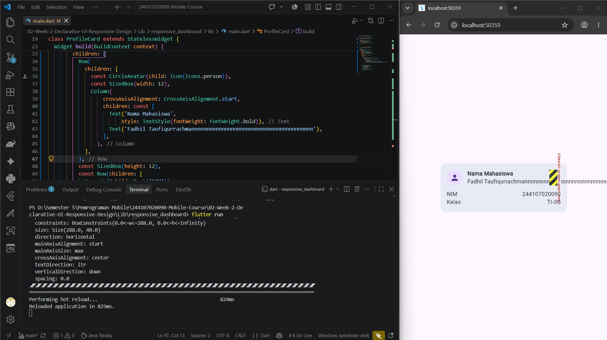

### Mengubah `mainAxisSize`

`Column` secara default menggunakan `MainAxisSize.max`, sehingga kolom akan mengambil seluruh tinggi dari tampilan yang tersedia. Penggunaan `MainAxisSize.min` membuat container dibatasi hanya setinggi kontennya. Jika nilai `min` diubah ke default `max`, card akan memanjang secara vertikal secara penuh.

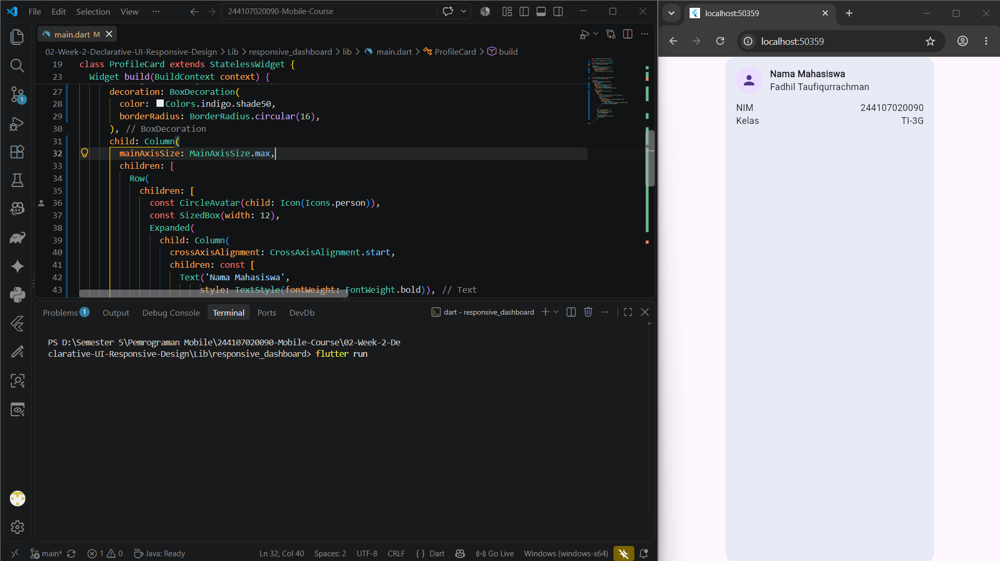

### Menambah baris data

Pola `Row` + `Expanded` dapat digunakan untuk menambah baris seperti Email. `Expanded` pada label pertama mendorong nilai ke sisi kanan sehingga tampilan menyerupai tabel sederhana.

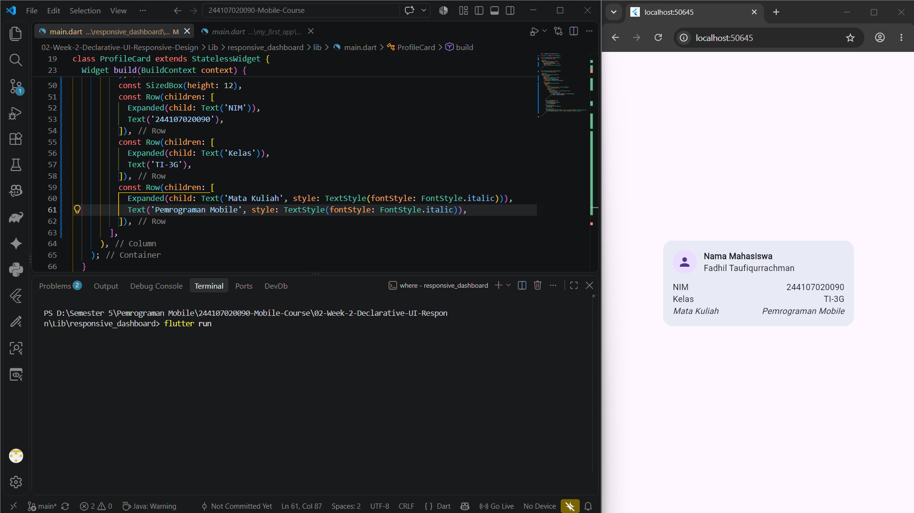

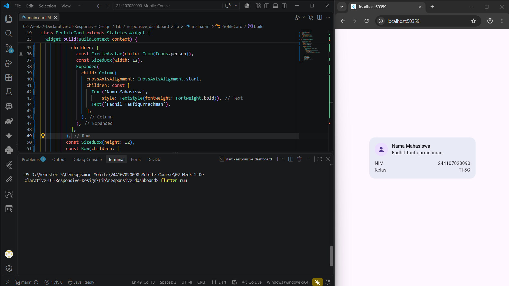

## 🔬 Eksperimen Responsive dan Theme

### Mengubah breakpoint

Breakpoint dapat diubah dari 700 menjadi 900. Dengan nilai tersebut, aplikasi baru berubah menjadi dua kolom ketika lebar area melebihi 900 piksel. Eksperimen ini menunjukkan bahwa responsive layout sebaiknya bergantung pada constraint area, bukan asumsi jenis perangkat.

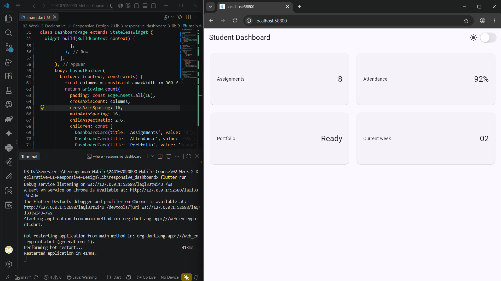

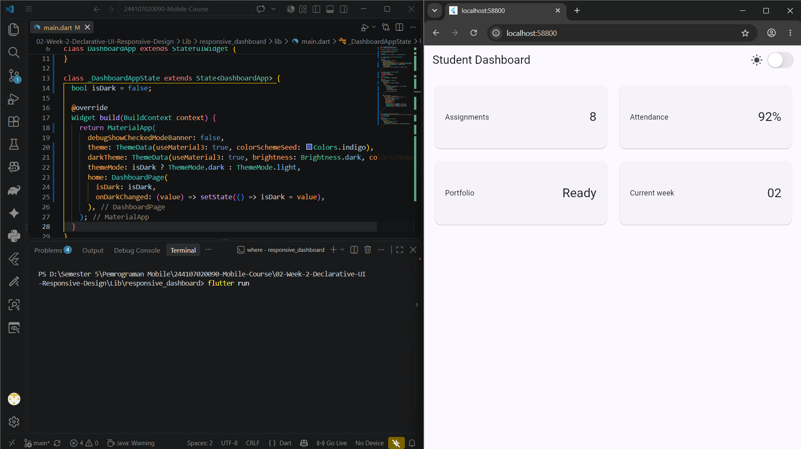

### Menguji mode gelap

Jika `themeMode` diubah menjadi `ThemeMode.dark`, aplikasi terkunci pada mode gelap dan switch tidak lagi menentukan warna tema. Jika menggunakan `ThemeMode.system`, tema mengikuti pengaturan sistem perangkat dan mengabaikan state switch buatan aplikasi.

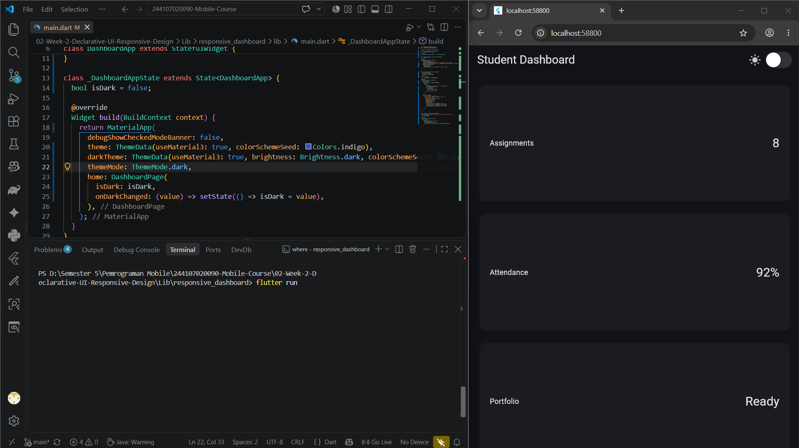

### Menguji orientasi dan ukuran layar

Pada orientasi landscape, lebar layar biasanya melewati breakpoint sehingga kartu akademik ditampilkan dalam dua kolom.


## 🤖 AI Prompt Challenge dan Keputusan Desain

### 1. Perbandingan pendekatan layout

Prompt yang digunakan:

> Bandingkan dua tata letak dashboard akademik untuk Flutter: versi GridView dan versi LayoutBuilder + Column. Jelaskan trade-off responsif dan aksesibilitasnya.

#### Pendekatan terpilih: `LayoutBuilder` + `GridView.count`

- **Responsivitas:** nilai `crossAxisCount` dapat diubah berdasarkan lebar area, dari satu kolom menjadi dua kolom;
- **Scrolling:** `GridView` menangani konten yang lebih panjang secara otomatis;
- **Aksesibilitas:** urutan elemen relatif natural, dari kiri ke kanan lalu baris berikutnya;
- **Trade-off:** `childAspectRatio` seragam, sehingga kurang fleksibel jika setiap kartu membutuhkan tinggi yang sangat berbeda.

#### Alternatif: `LayoutBuilder` + `Column` berisi `Row`

- **Kelebihan:** kontrol vertikal dan ukuran tiap baris lebih presisi;
- **Kekurangan:** pembagian item ke beberapa `Row` perlu ditulis manual;
- **Risiko:** kode lebih panjang, rentan overflow, dan biasanya membutuhkan `SingleChildScrollView`;
- **Aksesibilitas:** struktur `Row` dan `Column` yang terlalu bersarang dapat membingungkan screen reader jika tidak digabung dengan semantics yang sesuai.

Keputusan akhir adalah menggunakan kombinasi `LayoutBuilder` dan `GridView.count` karena lebih ringkas, responsif, dan sesuai untuk kartu-kartu akademik yang seragam.

### 2. Kapan `Expanded` dapat menyebabkan error?

`Expanded` hanya dapat bekerja jika parent memberikan batas ruang yang terukur. `Expanded` dapat menyebabkan error **RenderFlex with unbounded constraints** ketika diletakkan di dalam parent dengan ukuran tidak terbatas, misalnya `Row` di dalam `SingleChildScrollView` horizontal.

Contoh yang bermasalah:

```dart
SingleChildScrollView(
  scrollDirection: Axis.horizontal,
  child: Row(
    children: [
      const Icon(Icons.person),
      Expanded(
        child: Text('Teks yang sangat panjang...'),
      ),
    ],
  ),
)
```

Perbaikan dapat dilakukan dengan menghapus `Expanded` atau memberikan lebar yang pasti:

```dart
SingleChildScrollView(
  scrollDirection: Axis.horizontal,
  child: Row(
    children: [
      const Icon(Icons.person),
      Container(
        width: 250,
        child: const Text('Teks yang sangat panjang...'),
      ),
    ],
  ),
)
```

### 3. Verifikasi rekomendasi AI

Rekomendasi diaudit kembali dengan pertanyaan apakah layout tetap responsif di bawah 600 piksel, apakah aksesibilitas berkurang, dan apakah widget yang digunakan tersedia di Flutter stable.

Hasil verifikasi:

- **Responsif di bawah 600 px:** aman; kondisi `constraints.maxWidth >= 700 ? 2 : 1` memilih satu kolom;
- **Aksesibilitas:** tidak berkurang karena `Semantics` sudah dipasang pada `CupertinoSwitch`;
- **Ketersediaan API:** `GridView`, `LayoutBuilder`, `Semantics`, `CupertinoSwitch`, `Expanded`, dan `Flexible` merupakan bagian dari Flutter core API;
- **Automated test:** simulasi layar 400×800 digunakan untuk memverifikasi skenario layar sempit.

## ✅ Verifikasi dan Testing

File `test/widget_test.dart` berisi dua pengujian widget:

1. Layar 400×800 harus menghasilkan kartu dengan lebar kurang dari 700 piksel;
2. Layar 1200×800 harus menghasilkan kartu dengan lebar lebih dari 500 piksel.

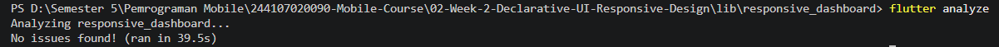

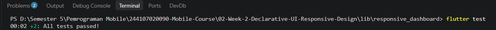

## 🖼️ Dokumentasi Screenshots

Seluruh screenshot hasil praktikum disertakan di repository.

### Proses pembuatan dan hasil dashboard

| Dokumentasi | Bukti |
| --- | --- |
| Membuat proyek Flutter | 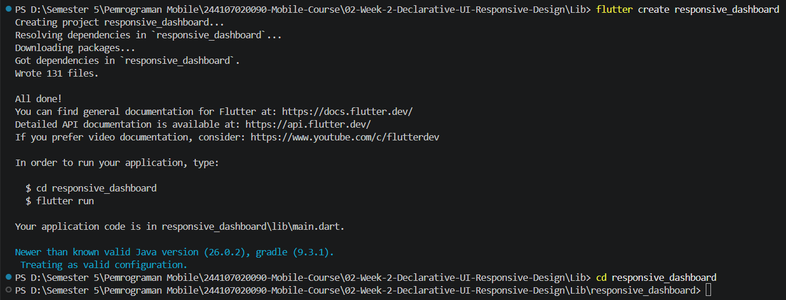 |
| Dashboard Academic Overview — landscape | 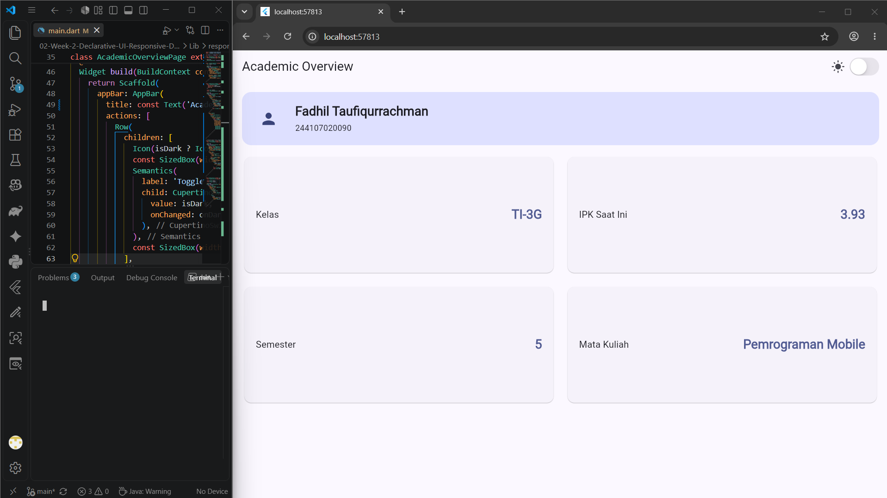 |
| Dashboard Academic Overview — portrait | 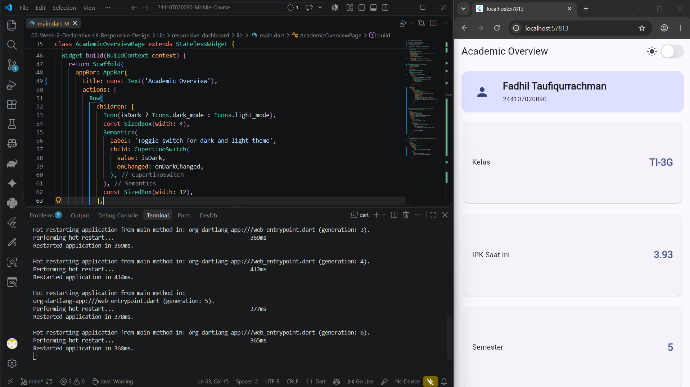 |
| Dashboard responsive | 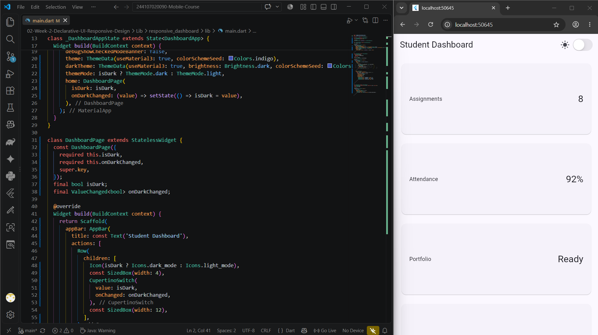 |
| Refactoring Academic Overview | 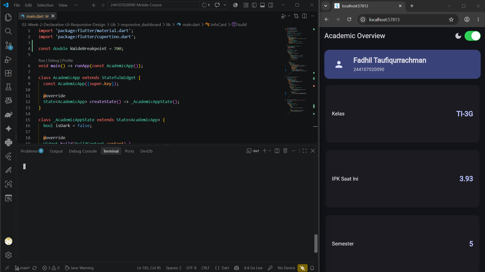 |

### Bukti tampilan pada mobile

| Mode | Bukti |
| --- | --- |
| Mobile light theme | 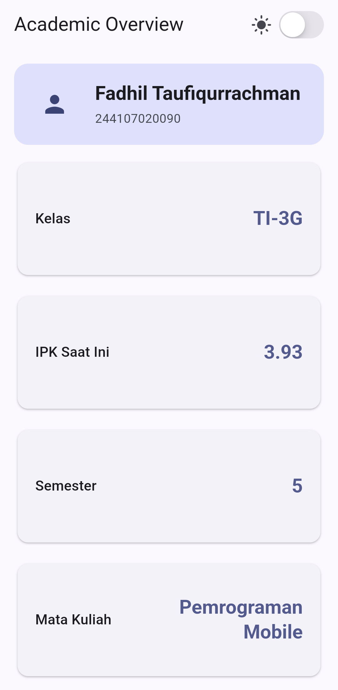 |
| Mobile dark theme | 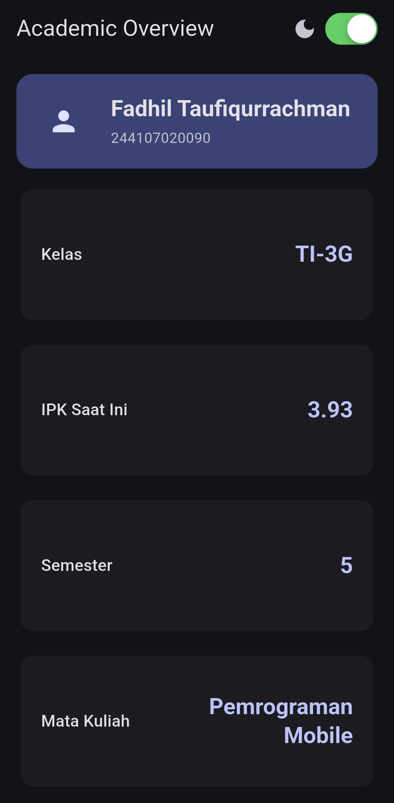 |

### Eksperimen layout, theme, dan aksesibilitas

| Eksperimen | Bukti |
| --- | --- |
| Expanded |  |
| Ukuran widget |  |
| Row |  |
| Warm-up layout |  |
| Breakpoint layout |  |
| Resolusi layar |  |
| Dark theme |  |
| Screen reader / Semantics | 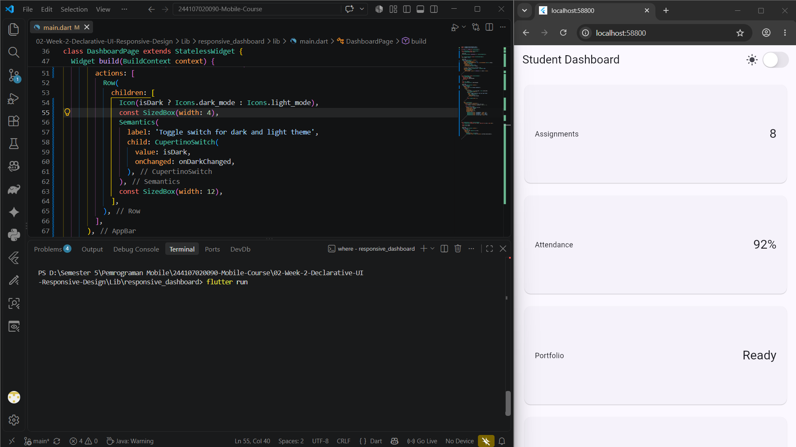 |

## 📝 Refleksi

### 1. Apa perbedaan cara berpikir imperative dan declarative saat membangun UI?

Pada pendekatan **imperative**, programmer akan memberi instruksi langkah demi langkah untuk mengubah UI, misalnya mencari elemen lalu mengganti warna atau teksnya secara manual. Pada pendekatan **declarative**, programmer mendeskripsikan UI berdasarkan state saat ini. Ketika state berubah, framework membangun kembali widget yang relevan. Flutter menggunakan pendekatan declarative sehingga `setState()` cukup mengubah state, lalu konfigurasi `MaterialApp` dan widget turunannya menghasilkan tampilan baru.

### 2. Kapan `Expanded` membantu dan kapan penggunaannya menghasilkan layout error?

`Expanded` membantu ketika berada di dalam `Row` atau `Column` yang memiliki batas ruang jelas. Widget ini membagi sisa ruang agar teks atau komponen dapat menyesuaikan diri dan tidak overflow. Sebaliknya, `Expanded` bermasalah jika parent memiliki constraint tidak terbatas, seperti `Row` di dalam horizontal `SingleChildScrollView`. Dalam kondisi tersebut Flutter tidak mengetahui sisa lebar yang harus dibagikan dan dapat menghasilkan error unbounded constraints.

### 3. Bagaimana breakpoint dan theme memengaruhi pengalaman pengguna?

Breakpoint membuat informasi tetap mudah dibaca pada berbagai ukuran layar. Satu kolom lebih sesuai untuk mobile yang sempit, sedangkan dua kolom memanfaatkan ruang pada tablet atau desktop. Theme dan dark mode memengaruhi kenyamanan visual, kontras, dan penggunaan aplikasi pada kondisi cahaya berbeda. Penggunaan `ColorScheme` membantu menjaga konsistensi warna ketika berpindah antara light theme dan dark theme.

### 4. Apa yang perlu diverifikasi dari rekomendasi AI setelah tugas selesai?

Rekomendasi AI tidak boleh langsung dianggap benar. Hal yang perlu diverifikasi adalah :

- Apakah widget dan API yang disarankan tersedia di Flutter stable;
- Apakah layout tetap aman pada layar sempit dan lebar;
- Apakah ada overflow atau constraint yang tidak terbatas;
- Apakah urutan dan label widget dapat dipahami screen reader;
- Apakah hasilnya benar-benar sesuai dengan tujuan desain;
- Apakah saran tersebut sudah diuji melalui `flutter analyze`, `flutter test`, dan uji visual.

Pada praktikum ini, verifikasi dilakukan dengan audit terhadap breakpoint 700 piksel, pengujian ukuran 400×800 dan 1200×800, pengecekan `Semantics`, serta perbandingan langsung dengan hasil aplikasi.

## 💡 Kesimpulan

Minggu kedua memperlihatkan bahwa UI Flutter bukan hanya susunan widget, tetapi juga hubungan antara **state, konfigurasi, constraint, dan layout**. Kombinasi `LayoutBuilder` dan `GridView.count` menghasilkan dashboard yang lebih mudah dipelihara serta dapat beradaptasi terhadap ukuran layar. Eksperimen `Expanded`, `mainAxisSize`, breakpoint, theme, dan semantics membantu memahami alasan teknis di balik perilaku layout Flutter. Kemudian tentang AI, kita boleh bertanya AI sebagai referensi dan membantu kita. Namun kita harus memahami apa yang dihasilkan oleh AI sekaligus mevalidasi apakah yang dihasilkan benar dan sesuai dengan tujuan. AI adalah alat untuk membantu mengerjakan, kita tetap harus sebagai pembuat keputusan.

## 🔗 Referensi

- [Flutter UI documentation](https://docs.flutter.dev/ui)
- [Building responsive apps](https://docs.flutter.dev/ui/layout/responsive/adaptive)
- [Flutter layout documentation](https://docs.flutter.dev/ui/layout)
- [Material Design 3](https://m3.material.io/)
- [Flutter accessibility](https://docs.flutter.dev/ui/accessibility)
- [Flutter testing documentation](https://docs.flutter.dev/testing)
- [Dart language documentation](https://dart.dev/language)

---

📌 **Repository:** [244107020090-Mobile-Course](https://github.com/FadhilTaufiqurrachman/244107020090-Mobile-Course)

👨‍💻 **Mahasiswa:** Fadhil Taufiqurrachman · **NIM:** 244107020090