# Minggu 3 — Navigation & State Management

> Dokumentasi Praktikum Mata Kuliah **Pemrograman Mobile**.

[](https://dart.dev/)
[](https://flutter.dev/)
[](https://pub.dev/packages/go_router)
[](https://riverpod.dev/)
[](https://docs.flutter.dev/testing)

## 🧭 Ringkasan

Minggu ketiga membahas navigasi modern dan state management pada Flutter. Praktikum terdiri atas dua project:

1. **`week3_navigation`** — contoh navigasi deklaratif menggunakan **GoRouter**, nested route, dan path parameter;
2. **`week3_todo`** — aplikasi ToDo yang menggunakan **Riverpod**, `AsyncValue`, `AsyncNotifier`, `ShellRoute`, serta widget dan unit testing.

Pembelajaran tidak hanya berfokus pada membuat halaman berpindah, tetapi juga pada pemisahan logika bisnis dari UI, immutability, penanganan state asinkron, refactoring widget, serta verifikasi hasil melalui analisis dan testing.

## 🎯 Tujuan Pembelajaran

Setelah menyelesaikan praktikum ini, saya diharapkan mampu:

1. Menjelaskan perbedaan navigasi imperative dan declarative;
2. Menggunakan `GoRouter`, `GoRoute`, nested route, path parameter, `context.go()`, dan `context.push()`;
3. Memahami alasan state management diperlukan ketika state dibagikan antar halaman;
4. Menggunakan `ProviderScope`, `Provider`, `Notifier`, `NotifierProvider`, `ConsumerWidget`, `ref.watch`, dan `ref.read`;
5. Mengelola state immutable menggunakan `copyWith()` dan pembuatan list baru;
6. Menangani state asinkron dengan `AsyncNotifier`, `AsyncValue`, dan `.when()`;
7. Membangun tampilan loading, error, success, dan aksi retry;
8. Melakukan refactoring widget dan memisahkan logika provider dari antarmuka;
9. Menjalankan unit test, widget test, `flutter analyze`, dan verifikasi visual.

## 🧰 Teknologi dan Tools

| Komponen | Penggunaan |
| --- | --- |
| **Dart** | Bahasa pemrograman aplikasi |
| **Flutter** | Framework UI lintas platform |
| **Material 3** | Komponen dan tema antarmuka |
| **GoRouter** | Navigasi deklaratif berbasis URL |
| **Flutter Riverpod** | State management dan dependency injection |
| **AsyncValue / AsyncNotifier** | Pemodelan loading, error, dan data |
| **flutter_test** | Unit test dan widget test |
| **ProviderContainer** | Pengujian provider tanpa membangun UI |
| **Visual Studio Code** | Editor, debugging, dan Flutter DevTools |
| **Git** | Version control dan dokumentasi progres |

## 📂 Struktur Folder

```text
03-Week-3-Navigation-State-Management/
├── README.md
├── Lib/
│   ├── week3_navigation/
│   │   ├── lib/
│   │   │   ├── main.dart                      # Konfigurasi GoRouter
│   │   │   └── pages/
│   │   │       ├── home_page.dart             # Daftar item dan navigasi detail
│   │   │       └── detail_page.dart           # Detail berdasarkan path parameter
│   │   ├── test/widget_test.dart              # Widget test project navigasi
│   │   ├── pubspec.yaml                       # Dependency GoRouter
│   │   └── analysis_options.yaml              # Konfigurasi analyzer
│   │
│   └── week3_todo/
│       ├── lib/
│       │   ├── main.dart                      # ProviderScope dan ShellRoute
│       │   ├── pages/
│       │   │   ├── todo_page.dart             # Daftar dan tambah ToDo
│       │   │   ├── stats_page.dart            # Data statistik async
│       │   │   └── product_page.dart          # Contoh AsyncValue produk
│       │   ├── providers/
│       │   │   ├── todo_provider.dart         # State ToDo dan derived provider
│       │   │   ├── stats_provider.dart        # State statistik async
│       │   │   └── product_provider.dart      # State produk async dan refresh
│       │   └── widgets/todo_tile.dart         # Widget baris ToDo terpisah
│       ├── test/
│       │   ├── stats_provider_test.dart       # Unit test AsyncNotifier
│       │   ├── todo_widget_test.dart          # Widget test tambah ToDo
│       │   └── widget_test.dart               # Template test bawaan Flutter
│       ├── pubspec.yaml                       # Dependency Riverpod dan GoRouter
│       └── analysis_options.yaml
│
└── Screenshots/                               # Dokumentasi proses dan hasil
```

## 🚀 Cara Menjalankan

### Persyaratan

- Git;
- Flutter SDK dan Dart SDK;
- Visual Studio Code dengan ekstensi Flutter dan Dart;
- Chrome, Android Emulator, atau perangkat Android sebagai target;
- Android SDK dan lisensi Android jika menggunakan perangkat/emulator Android.

Verifikasi environment dengan perintah berikut:

```bash
flutter --version
flutter doctor -v
flutter devices
```

Jika menggunakan Android, jalankan juga:

```bash
flutter doctor --android-licenses
```

Untuk perangkat fisik Android, aktifkan **Developer options** dan **USB debugging**, sambungkan perangkat melalui USB, izinkan debugging ketika diminta, kemudian pastikan perangkat muncul pada `flutter devices`.

### Menjalankan project navigasi

```bash
git clone https://github.com/FadhilTaufiqurrachman/244107020090-Mobile-Course.git
cd 244107020090-Mobile-Course/03-Week-3-Navigation-State-Management/Lib/week3_navigation
flutter pub get
flutter run -d chrome
```

Project dapat dijalankan pada device lain dengan mengganti target:

```bash
flutter devices
flutter run -d <device-id>
```

### Menjalankan project ToDo dan Riverpod

Buka terminal baru atau kembali ke root repository, lalu jalankan:

```bash
cd 244107020090-Mobile-Course/03-Week-3-Navigation-State-Management/Lib/week3_todo
flutter pub get
flutter run -d chrome
```

### Menjalankan analisis dan test

Jalankan perintah berikut dari masing-masing folder project:

```bash
flutter analyze
flutter test
```

Perintah tersebut perlu dijalankan di `Lib/week3_navigation` dan `Lib/week3_todo` karena keduanya merupakan package Flutter yang terpisah.

## Navigasi dengan GoRouter

### Navigator 1.0 dan GoRouter

Navigator 1.0 biasanya menggunakan cara imperative, misalnya memanggil `Navigator.push()` secara langsung untuk menumpuk halaman. GoRouter menggunakan cara declarative, yang artinya hubungan antara URL dan halaman didefinisikan dalam konfigurasi route.

GoRouter lebih sesuai untuk aplikasi yang membutuhkan:

- nested routing;
- deep linking;
- path parameter;
- redirect atau guard;
- URL yang merepresentasikan halaman aktif;
- konfigurasi navigasi yang terpusat.

### Konfigurasi route

Pada `week3_navigation/lib/main.dart`, aplikasi menggunakan `MaterialApp.router` dan route berikut:

```dart
final _router = GoRouter(
  initialLocation: '/',
  routes: [
    GoRoute(
      path: '/',c
      builder: (context, state) => const HomePage(),
      routes: [
        GoRoute(
          path: 'detail/:id',
          builder: (context, state) => DetailPage(
            id: state.pathParameters['id']!,
          ),
        ),
      ],
    ),
  ],
);
```

Rute `detail/:id` merupakan nested route dari halaman utama. Bagian `:id` adalah path parameter dinamis.

### Navigasi dari Home ke Detail

`HomePage` menampilkan sepuluh item. Ketika item ditekan, aplikasi membuat URL detail berdasarkan nomor item:

```dart
onTap: () => context.go('/detail/${index + 1}')
```

`DetailPage` menerima ID melalui constructor dan menampilkannya pada AppBar serta body halaman.

### `context.go()` dan `context.push()`

| Method | Perilaku | Contoh penggunaan |
| --- | --- | --- |
| `context.go()` | Berpindah ke lokasi secara deklaratif dan mengganti lokasi aktif | Pindah antar tab, redirect login, logout |
| `context.push()` | Menambahkan halaman baru ke stack navigasi | Membuka detail dari daftar dan mempertahankan tombol Back |

Pada navigasi menu yang sejajar, `context.go()` cocok digunakan. Sedangkan ntuk alur yang membutuhkan riwayat kembali, `context.push()` adalah pilihan yang lebih tepat.

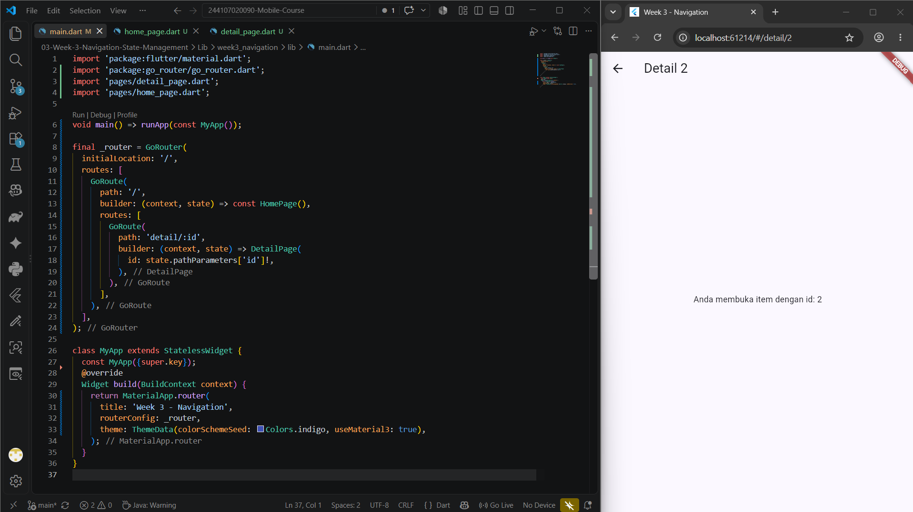

## State Management dengan Riverpod

### Mengapa membutuhkan state management?

`setState()` masih sesuai untuk state lokal dalam satu widget. Namun, ketika data perlu dibagikan antar halaman, penggunaan `setState()` dapat menghasilkan **prop drilling** (Mengirim data melalui banyak constructor widget).

Riverpod membantu dengan cara:

- Memisahkan logika bisnis dari UI;
- Menyediakan state yang dapat dibaca oleh banyak widget;
- Menjaga state agar tetap tersedia ketika widget tidak sedang terlihat;
- Membuat logika dapat diuji tanpa membangun seluruh UI;
- Memberikan API yang compile-safe dan tidak bergantung sepenuhnya pada `BuildContext`.

### Aktor utama Riverpod

| Komponen | Fungsi |
| --- | --- |
| `ProviderScope` | Wadah root yang menyimpan provider dan wajib membungkus aplikasi |
| `Provider` | Menyediakan nilai read-only atau derived value |
| `Notifier` | Mengelola state synchronous yang dapat berubah melalui method |
| `NotifierProvider` | Mengekspos `Notifier` kepada widget |
| `AsyncNotifier` | Mengelola state yang berasal dari proses asynchronous |
| `ConsumerWidget` | Widget yang dapat membaca provider melalui `WidgetRef` |
| `ref.watch` | Membaca state dan memicu rebuild |
| `ref.read` | Membaca atau memanggil notifier di dalam callback tanpa subscribe |

### `ref.watch` dan `ref.read`

Aturan penggunaannya:

```dart
// Di dalam build: UI mengikuti perubahan state.
final todos = ref.watch(todoListProvider);

// Di dalam callback: jalankan aksi satu kali.
ref.read(todoListProvider.notifier).add('Belajar Riverpod');
```

`ref.watch` digunakan dalam `build()` ketika tampilan harus dibangun ulang saat data berubah. `ref.read` digunakan pada aksi seperti tombol tambah, checkbox, hapus, atau retry.

## Implementasi Aplikasi ToDo

### Model dan immutability

Model `Todo` menyimpan `title` dan status `done`. Perubahan object dilakukan menggunakan `copyWith()` sehingga object lama tidak dimutasi langsung:

```dart
Todo copyWith({String? title, bool? done}) =>
    Todo(title ?? this.title, done: done ?? this.done);
```

`TodoListNotifier` menyediakan method:

- `add(String title)` untuk menambah tugas;
- `toggle(int index)` untuk mengubah status selesai;
- `remove(int index)` untuk menghapus tugas.

Setiap operasi menghasilkan list baru menggunakan spread operator, bukan mengubah `state` secara langsung:

```dart
void add(String title) => state = [...state, Todo(title)];
```

### Derived provider

`uncompletedTodoProvider` adalah derived provider yang mengembalikan daftar tugas yang belum selesai. 

### UI ToDo dan ekstraksi `TodoTile`

`TodoPage` menggunakan `ConsumerWidget` untuk membaca `todoListProvider`. Widget `TodoTile` dipisahkan ke file tersendiri agar `build()` pada halaman utama tetap ringkas. Setiap tile menyediakan:

- checkbox untuk toggle status;
- teks dengan `TextDecoration.lineThrough` ketika selesai;
- tombol hapus;
- akses ke notifier melalui `ref.read`.

Tombol Floating Action Button membuka dialog untuk menambahkan tugas baru.


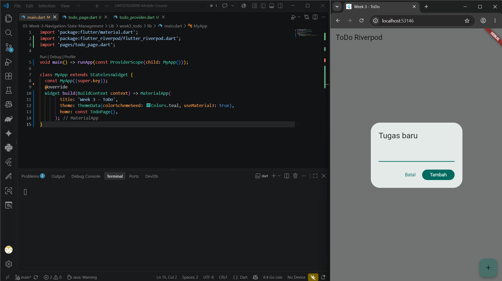

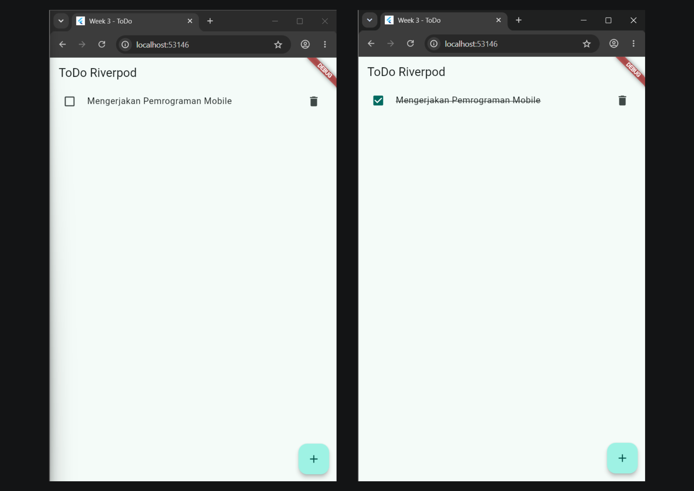

## ShellRoute dan Bottom Navigation

Pada `week3_todo`, `ShellRoute` digunakan untuk membuat layout bersama yang tetap tampil ketika child route berganti. `MainLayout` menyediakan `NavigationBar` dengan dua destination:

- **ToDo** pada route `/`;
- **Stats** pada route `/stats`.

Saat pengguna memilih tab, `context.go()` mengubah URL. Shell tetap mempertahankan `Scaffold` dan bottom navigation, sementara area `body` menampilkan child page yang aktif.

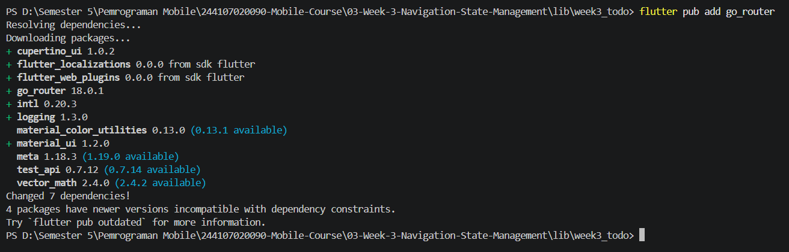

## AsyncValue: Loading, Error, dan Success

### Masalah state async manual

Ketika mengambil data dari API atau sumber asynchronous, UI minimal harus menangani tiga kemungkinan:

1. **Loading** — data sedang diambil;
2. **Error** — proses gagal;
3. **Success/Data** — data tersedia.

Jika ketiganya dikelola menggunakan boolean terpisah seperti `isLoading`, `hasError`, dan `hasData`, maka dapat terjadi kemungkinan kombinasi state yang tidak logis. `AsyncValue<T>` berfumgsi untuk memodelkan ketiga kondisi tersebut sebagai state yang terstruktur.

### Product provider

`productsProvider` memakai `AsyncNotifier<List<String>>` dan mensimulasikan network delay dua detik. Saat berhasil, data yang ditampilkan adalah:

```text
Keyboard
Mouse
Monitor
```

Provider juga memiliki method `refresh()` yang mengatur state menjadi `AsyncLoading`, kemudian menggunakan `AsyncValue.guard()` untuk menangkap exception dengan aman. Method `_fetch()` mensimulasikan refresh dan menambahkan item Headset.

### Stats provider

`statsProvider` mensimulasikan pengambilan data statistik selama dua detik. Terdapat kemungkinan error sebesar 30% menggunakan `Random().nextDouble()`. Saat berhasil, provider menghasilkan:

```text
Total Pengguna Aktif: 1,540
Pendapatan Bulan Ini: Rp 24.500.000
Tingkat Konversi: 4.8%
```

### Rendering dengan `.when()`

`StatsPage` memantau provider lalu menangani semua kondisi secara eksplisit:

```dart
final statsAsync = ref.watch(statsProvider);

return statsAsync.when(
  loading: () => const CircularProgressIndicator(),
  error: (err, stack) => RetryButton(),
  data: (stats) => ListView.builder(...),
);
```

Pada kondisi error, tombol **Coba Lagi (Retry)** memanggil `ref.invalidate(statsProvider)`. State lama dibuang, provider menjalankan `build()` kembali, lalu UI melewati loading menuju data atau error baru.

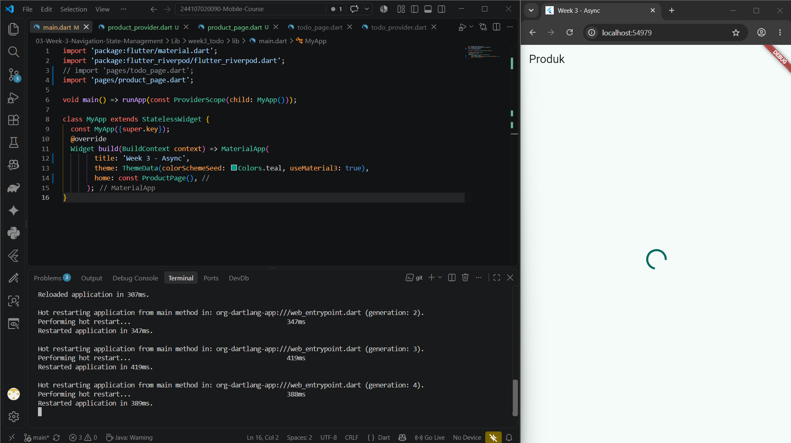

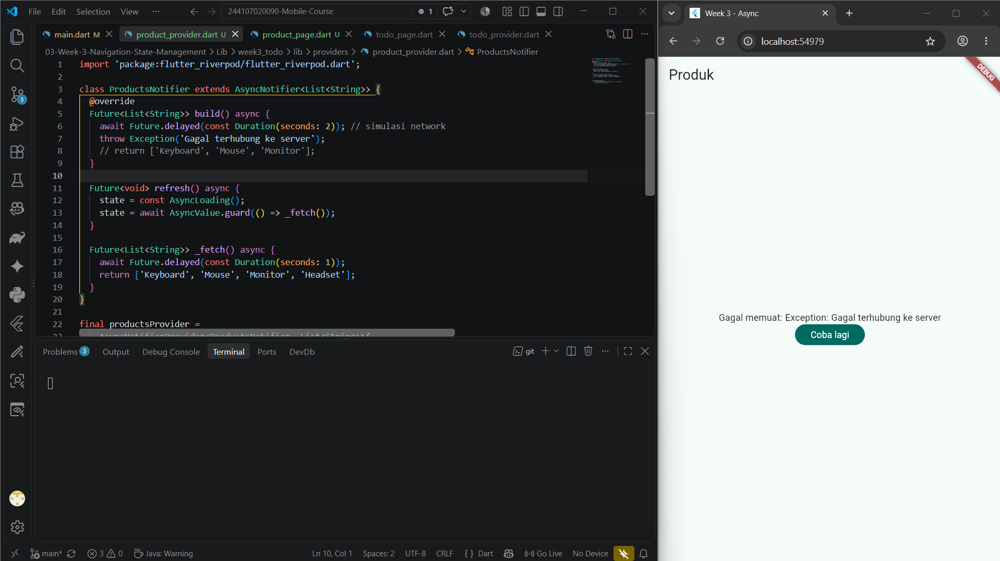


## AI Challenge dan Evaluasi Kode

AI digunakan sebagai **co-developer**, terutama untuk membantu membuat blueprint dan mengeksplorasi alternatif implementasi. Namun, kualitas hasil tidak hanya ditentukan oleh banyaknya kode yang dihasilkan. Prompt harus jelas, hasil harus dipahami, dan implementasi harus diuji secara mandiri.

### Implementasi StatsPage

AI challenge menghasilkan fitur statistik dengan komponen berikut:

- `StatsNotifier` berbasis `AsyncNotifier`;
- delay jaringan dua detik;
- simulasi probabilitas error 30%;
- UI loading, error, dan success menggunakan `.when()`;
- tombol retry menggunakan `ref.invalidate()`;
- unit test memakai `ProviderContainer`.

### Checklist evaluasi

1. State immutable dan tidak menggunakan mutasi langsung seperti `state.add()`;
2. `ref.watch` hanya digunakan pada `build()`;
3. Callback memakai `ref.read` atau `ref.invalidate`;
4. Loading, error, dan data ditampilkan secara eksplisit;
5. Provider memiliki tipe yang jelas;
6. API Riverpod yang digunakan adalah API modern;
7. Kode diverifikasi dengan `flutter analyze` dan `flutter test`.

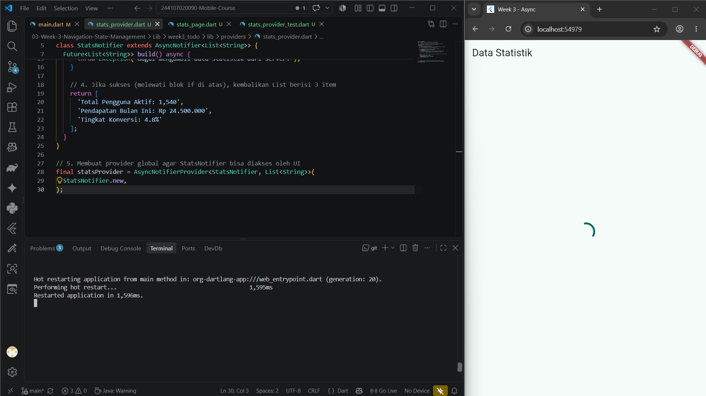

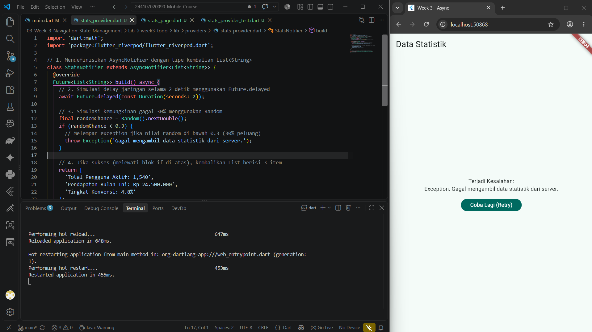

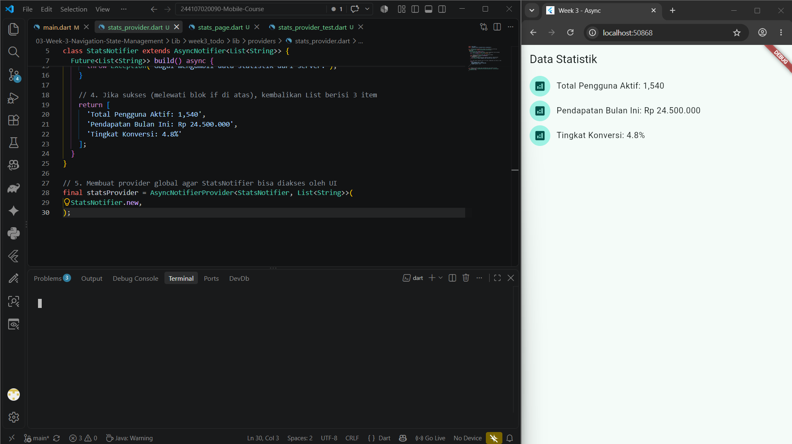

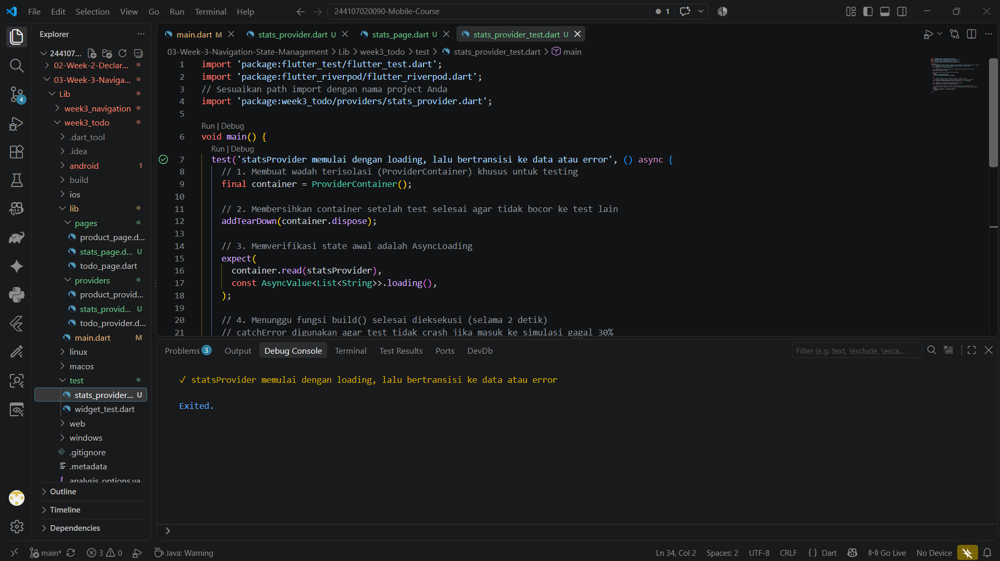

## 🧪 Refactoring dan Testing

### Tujuan refactoring

Refactoring memodifikasi kode tanpa mengubah perilaku eksternal. Tujuannya adalah membuat kode lebih mudah dibaca, modular, dipelihara, dan diuji.

Tiga refactoring utama pada aplikasi ToDo adalah:

1. **Ekstraksi `TodoTile`** — memindahkan desain satu baris ToDo dari `todo_page.dart` ke widget terpisah;
2. **Derived provider** — memindahkan logika filter tugas yang belum selesai dari UI ke provider;
3. **Integrasi `ShellRoute`** — menyediakan `NavigationBar` bersama tanpa menduplikasi layout di setiap halaman.

### Widget testing

Widget test menyimulasikan interaksi pengguna pada layar virtual tanpa emulator sungguhan. Alur test tambah ToDo adalah:

1. Memuat aplikasi dengan `ProviderScope`;
2. Memastikan teks awal **Belum ada tugas** muncul;
3. Menekan tombol tambah;
4. Mengetik teks pada `TextField`;
5. Menekan tombol **Tambah**;
6. Memastikan teks tugas baru muncul pada daftar.

`pumpAndSettle()` diperlukan setelah membuka atau menutup dialog agar tester menunggu animasi selesai sepenuhnya. Menggunakan `pump()` saja dapat membuat widget dialog dan widget daftar terdeteksi bersamaan sehingga matcher menghasilkan error seperti **Which: is too many**.

### Unit test provider

`stats_provider_test.dart` menggunakan `ProviderContainer` untuk menguji provider tanpa membangun UI. Test memeriksa bahwa:

- state awal adalah `AsyncLoading`;
- proses asynchronous selesai setelah delay;
- state akhir memiliki value atau error;
- container di-dispose setelah test untuk mencegah kebocoran resource.

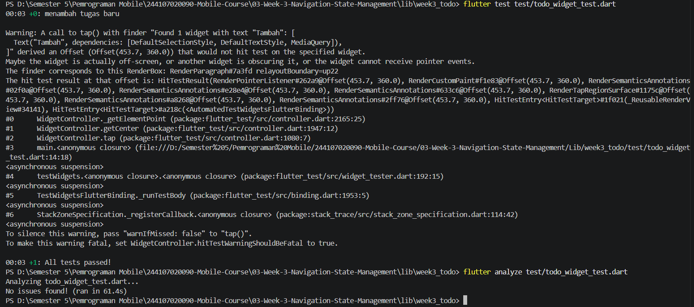

## 🖼️ Dokumentasi Screenshots

Seluruh screenshot Week 3 disertakan pada folder `Screenshots/`.

| Dokumentasi | Bukti |
| --- | --- |
| Membuat project Flutter | 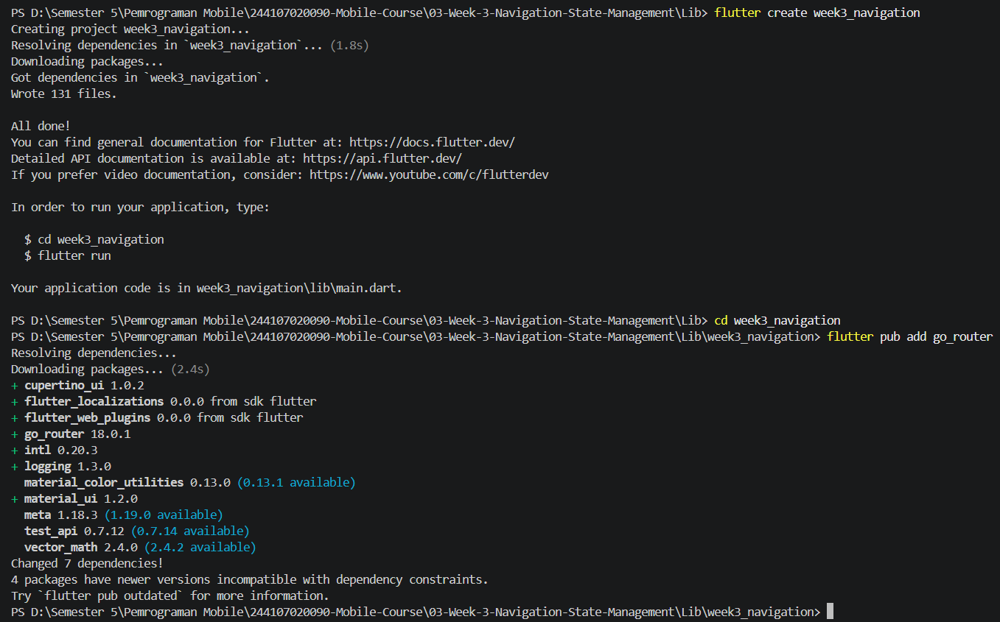 |
| Membuat project ToDo | 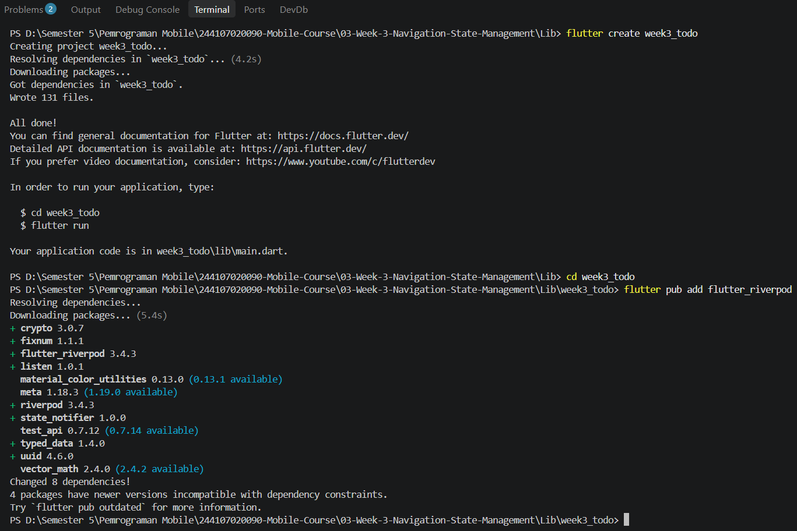 |
| Hasil navigasi path router |  |
| Menambahkan GoRouter |  |
| Halaman ToDo |  |
| Daftar ToDo |  |
| Menambahkan tugas baru |  |
| Loading state |  |
| Error state |  |
| Loading AI challenge |  |
| Error AI challenge |  |
| List AI challenge |  |
| Verifikasi AI test |  |
| Verifikasi analyze dan test |  |
| Hasil mini project | 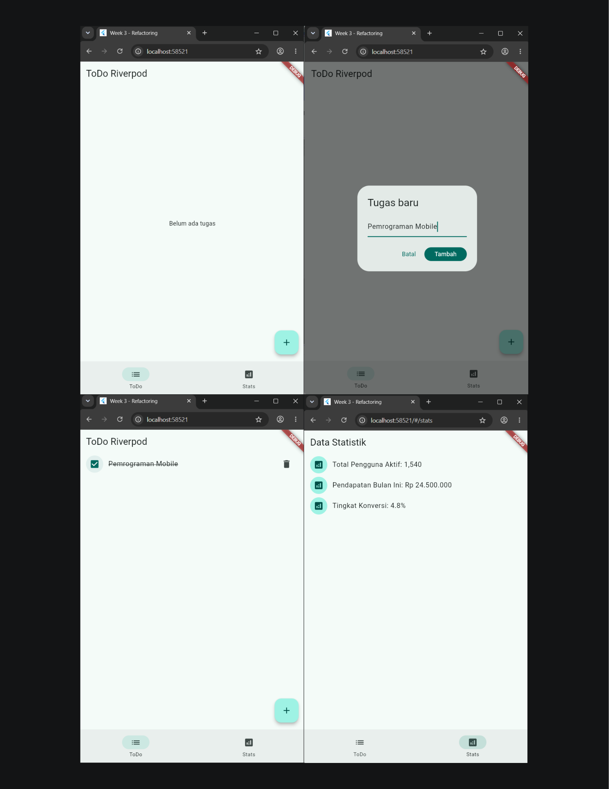 |

## 📝 Refleksi

### 1. Kapan `setState` masih cukup, dan kapan state perlu dinaikkan ke Riverpod?

`setState` masih cukup untuk local state yang hanya berdampak pada satu widget atau satu halaman, seperti membuka dan menutup menu, mengatur animasi tombol, atau mengubah checkbox sederhana. State sebaiknya dikelola Riverpod ketika data dibutuhkan oleh beberapa widget atau halaman, misalnya daftar ToDo yang dibuat di halaman utama tetapi juga diringkas pada halaman statistik. Riverpod juga tepat digunakan ketika logika bisnis perlu dipisahkan dari UI dan ketika prop drilling mulai membuat constructor menjadi rumit.

### 2. Apa perbedaan `context.go` dan `context.push`, dan kapan masing-masing digunakan?

`context.go` berpindah ke lokasi secara mutlak berdasarkan konfigurasi router. Method ini cocok untuk perpindahan antar menu setara atau redirect, karena tidak selalu mempertahankan riwayat halaman sebelumnya. `context.push` menambahkan rute baru ke stack, sehingga cocok untuk alur master-detail ketika pengguna diharapkan dapat menekan tombol Back untuk kembali ke daftar.

### 3. Bagaimana `AsyncValue` mencegah bug dibandingkan tiga boolean terpisah?

Tiga boolean seperti `isLoading`, `hasError`, dan `hasData` dapat berada pada kombinasi yang saling bertentangan. Contohnya, `isLoading` dan `hasError` tidak sengaja sama-sama bernilai true. `AsyncValue` menyatukan status tersebut dalam satu tipe yang mutually exclusive: loading, error, atau data. Penggunaan `.when()` juga membuat developer merancang UI untuk semua kondisi sehingga aplikasi tidak mudah menampilkan blank screen ketika koneksi gagal.

### 4. Bagian mana dari hasil AI yang diperbaiki, dan mengapa?

Bagian yang perlu diperhatikan adalah simulasi widget testing saat dialog tambah ToDo ditutup. Jika hanya menggunakan `pump()`, animasi penutupan dialog mungkin belum selesai sehingga teks tugas dapat terdeteksi di lebih dari satu tempat dan memunculkan error **Which: is too many**. Penggunaan `pumpAndSettle()` memperbaiki masalah tersebut dengan menunggu seluruh animasi selesai sebelum test mencari dan memverifikasi tugas baru.

### 5. Apa pembelajaran utama dari Week 3?

Pembelajaran utama adalah bahwa navigasi dan state management harus dirancang bersama. GoRouter membuat struktur halaman lebih eksplisit melalui URL, sedangkan Riverpod mengelola data dan logika agar tidak melekat pada widget tertentu. `AsyncValue` membantu menjadikan loading, error, dan success sebagai bagian wajib dari desain UI. AI dapat membantu menghasilkan alternatif dan boilerplate, tetapi hasilnya tetap harus dibaca, diuji, diperbaiki, serta divalidasi oleh developer.

## 💡 Kesimpulan

Week 3 memperluas pemahaman dari UI statis menjadi aplikasi Flutter yang memiliki navigasi, data yang berubah, proses asynchronous, dan pengujian. `GoRouter` digunakan untuk navigasi deklaratif berbasis URL, sementara Riverpod digunakan untuk state global, state immutable, derived state, dan asynchronous state. Refactoring `TodoTile`, penggunaan `ShellRoute`, penanganan `.when()`, serta widget dan unit testing membuat codebase lebih modular dan lebih siap dikembangkan.

## 🔗 Referensi

- [Flutter navigation and routing](https://docs.flutter.dev/ui/navigation)
- [GoRouter package](https://pub.dev/packages/go_router)
- [Riverpod documentation](https://riverpod.dev/)
- [Flutter Riverpod package](https://pub.dev/packages/flutter_riverpod)
- [Flutter testing documentation](https://docs.flutter.dev/testing)
- [Flutter widget testing](https://docs.flutter.dev/cookbook/testing/widget/introduction)
- [Dart language documentation](https://dart.dev/language)

---

📌 **Repository:** [244107020090-Mobile-Course](https://github.com/FadhilTaufiqurrachman/244107020090-Mobile-Course)

👨‍💻 **Mahasiswa:** Fadhil Taufiqurrachman · **NIM:** 244107020090