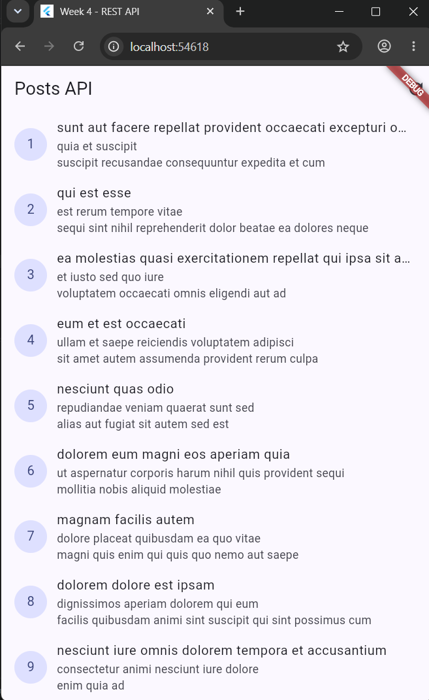
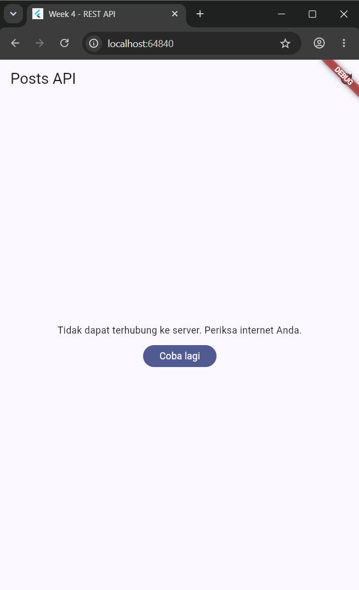
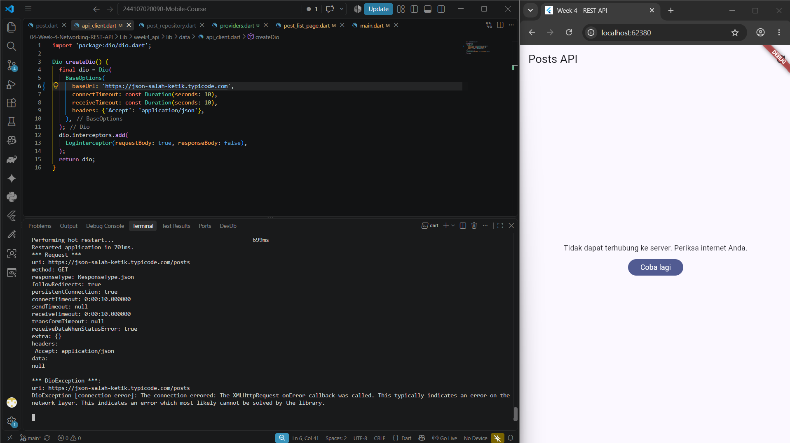
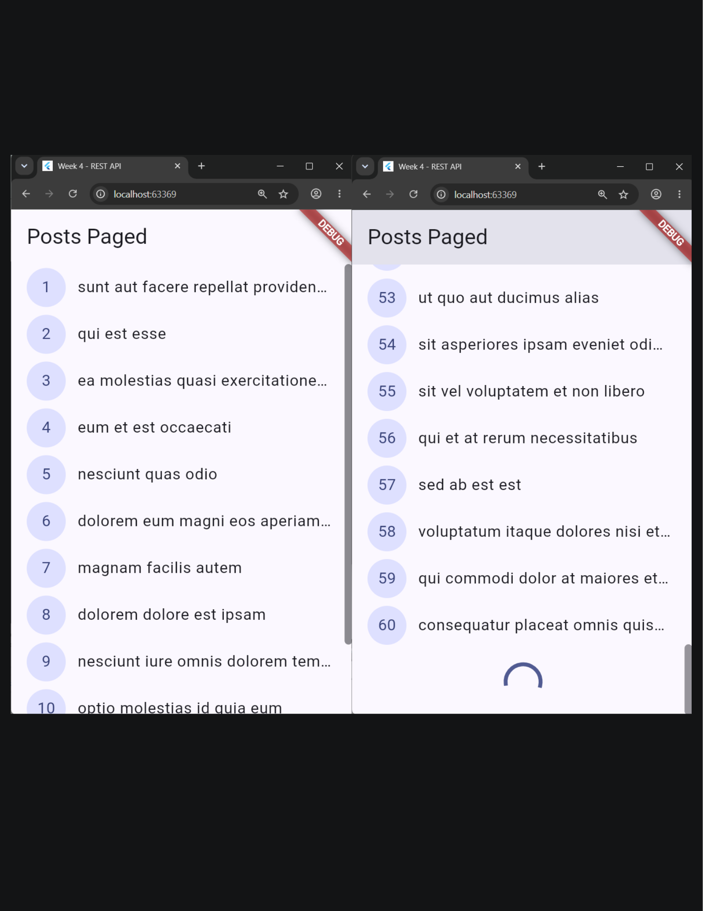
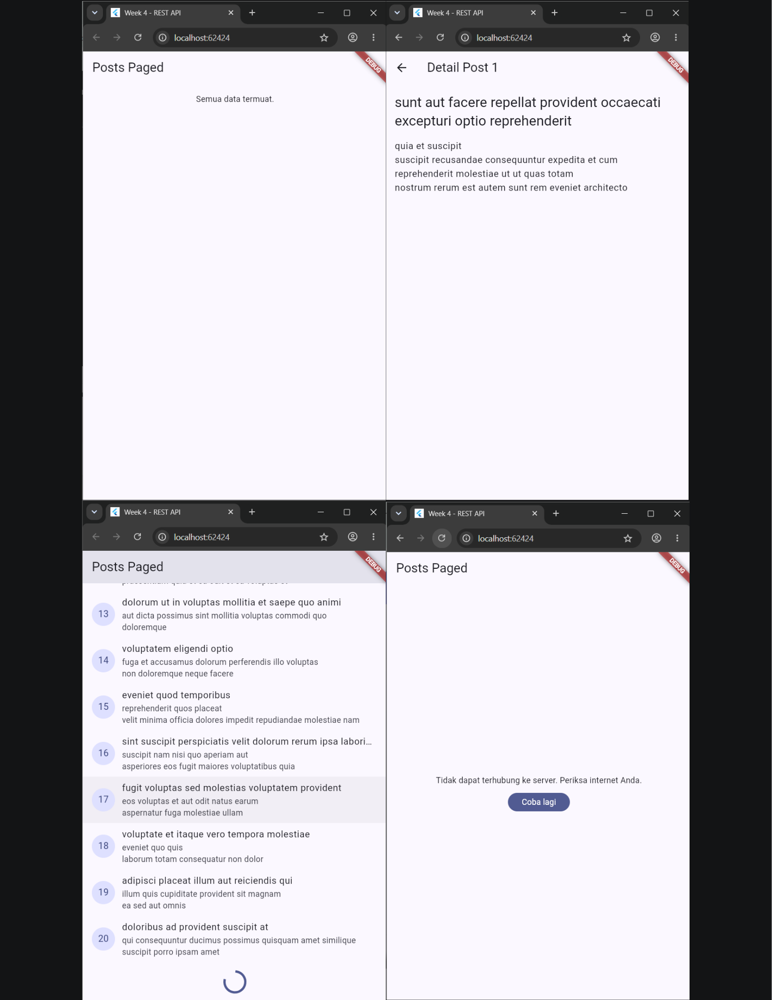
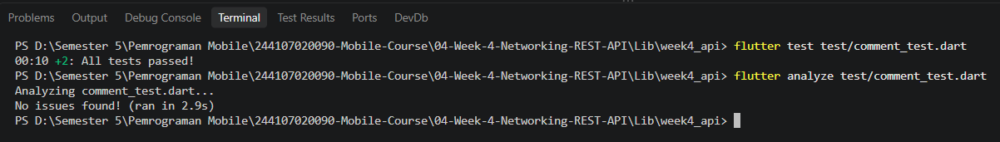
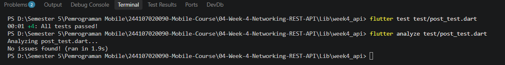
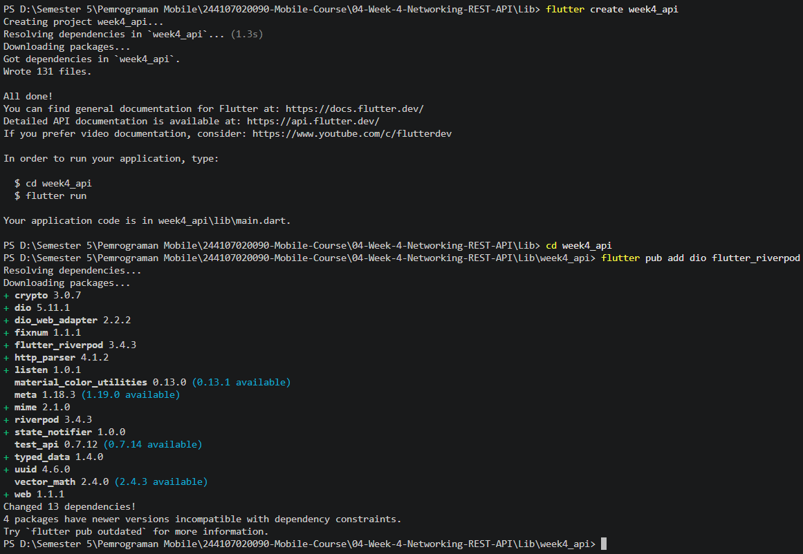

# Minggu 4 — Networking & REST API

> Dokumentasi Praktikum Mata Kuliah **Pemrograman Mobile**.

[](https://dart.dev/)
[](https://flutter.dev/)
[](https://pub.dev/packages/dio)
[](https://riverpod.dev/)
[](https://docs.flutter.dev/testing)

## 🧭 Ringkasan

Minggu keempat membahas komunikasi data pada aplikasi Flutter menggunakan **HTTP**, **REST API**, dan format **JSON**. Praktikum akan menghasilkan aplikasi yang mengambil data post dari JSONPlaceholder, memetakan respons JSON ke model Dart, menampilkan loading/error/data, menyediakan retry, membuka detail post, serta menerapkan pagination dengan infinite scroll.

Praktikum ini juga menerapkan pemisahan tanggung jawab menggunakan **API client**, **repository**, **Riverpod provider**, dan **UI page**. Pada bagian lanjutan, ditambahkan model dan repository komentar, defensive parsing terhadap field yang hilang, pengujian dengan fake repository, serta refactoring widget dan error handling.

## 🎯 Tujuan Pembelajaran

Setelah menyelesaikan praktikum ini, saya diharapkan mampu:

1. Menjelaskan HTTP, REST API, method GET/POST, dan karakteristik REST yang stateless;
2. Memahami JSON serta proses serialization dan deserialization ke object Dart;
3. Menggunakan Dio untuk request HTTP, base URL, timeout, dan interceptor;
4. Menerapkan Repository Pattern agar UI tidak memanggil Dio secara langsung;
5. Mengelola data asynchronous menggunakan Riverpod `AsyncNotifier` dan `AsyncValue`;
6. Menangani kondisi loading, error, empty, dan success pada UI;
7. Menerjemahkan error teknis jaringan menjadi pesan yang ramah bagi pengguna;
8. Membuat pagination berbasis `_page` dan `_limit` dengan infinite scroll;
9. Menguji model, repository, provider, dan edge case tanpa bergantung pada koneksi internet nyata;
10. Melakukan refactoring dan memverifikasi kualitas kode menggunakan `flutter analyze` dan `flutter test`.

## 🧰 Teknologi dan Tools

| Komponen | Penggunaan |
| --- | --- |
| **Dart** | Bahasa pemrograman aplikasi |
| **Flutter** | Framework UI lintas platform |
| **Dio** | HTTP client untuk request REST API |
| **JSONPlaceholder** | REST API publik sebagai sumber data post dan komentar |
| **Riverpod** | State management dan dependency injection |
| **GoRouter** | Navigasi ke halaman detail post |
| **AsyncNotifier / AsyncValue** | Pengelolaan state asynchronous |
| **ProviderContainer** | Pengujian provider secara terisolasi |
| **flutter_test** | Unit test dan widget test |
| **Visual Studio Code** | Editor dan debugging |
| **Git** | Version control dan dokumentasi progres |

## 📂 Struktur Folder

```text
04-Week-4-Networking-REST-API/
├── README.md
├── Lib/
│   └── week4_api/
│       ├── lib/
│       │   ├── main.dart                           # ProviderScope dan konfigurasi GoRouter
│       │   ├── data/
│       │   │   ├── api_client.dart                 # Konfigurasi Dio dan base URL
│       │   │   ├── network_errors.dart             # Pesan error jaringan yang ramah pengguna
│       │   │   ├── paged_posts.dart                # State dan notifier pagination
│       │   │   ├── providers.dart                  # Provider repository dan post list
│       │   │   ├── models/
│       │   │   │   ├── post.dart                   # Model Post dan fromJson/toJson
│       │   │   │   └── comment.dart                # Model Comment dengan null safety
│       │   │   ├── providers/
│       │   │   │   └── comment_provider.dart       # Provider data komentar
│       │   │   └── repositories/
│       │   │       ├── post_repository.dart        # Request post dan pagination
│       │   │       └── comment_repository.dart     # Request komentar per post
│       │   ├── pages/
│       │   │   ├── paged_post_page.dart            # Halaman post dengan infinite scroll
│       │   │   ├── post_list_page.dart             # Halaman post non-paged dan refresh
│       │   │   └── post_detail_page.dart           # Detail post
│       │   └── widgets/
│       │       └── post_tile.dart                  # Widget reusable untuk satu post
│       ├── test/
│       │   ├── comment_test.dart                   # Test model Comment dan edge case
│       │   ├── post_test.dart                      # Test model, repository, dan error
│       │   └── widget_test.dart                    # Template widget test Flutter
│       ├── pubspec.yaml                            # Metadata dan dependency
│       └── analysis_options.yaml                   # Konfigurasi analyzer dan lint
├── Screenshots/                                    # Dokumentasi proses dan hasil
└── Test/                                           # Bukti analyze dan testing
```

## 🚀 Cara Menjalankan

### Persyaratan

- Git;
- Flutter SDK dan Dart SDK;
- Visual Studio Code dengan ekstensi Flutter dan Dart;
- Chrome, Android Emulator, atau perangkat Android sebagai target;
- Android SDK dan lisensi Android jika menggunakan emulator/perangkat Android;
- Koneksi internet untuk mengakses JSONPlaceholder saat aplikasi dijalankan.

Verifikasi environment dengan perintah berikut:

```bash
flutter --version
flutter doctor -v
flutter devices
```

Jika menggunakan target Android, selesaikan lisensi SDK dengan:

```bash
flutter doctor --android-licenses
```

Untuk perangkat fisik Android, aktifkan **Developer options** dan **USB debugging**, sambungkan perangkat menggunakan kabel USB, izinkan akses debugging, lalu pastikan perangkat terdeteksi dengan `flutter devices`.

### Menjalankan aplikasi

```bash
git clone https://github.com/FadhilTaufiqurrachman/244107020090-Mobile-Course.git
cd 244107020090-Mobile-Course/04-Week-4-Networking-REST-API/Lib/week4_api
flutter pub get
flutter run -d chrome
```

Jika ingin menggunakan target lain:

```bash
flutter devices
flutter run -d <device-id>
```

### Menjalankan analisis dan test

Jalankan dari folder project `Lib/week4_api`:

```bash
flutter analyze
flutter test
```

## 🌐 Konsep Dasar Networking

### HTTP

HTTP adalah protokol yang digunakan client dan server untuk bertukar data. Pada praktikum ini, aplikasi terutama menggunakan method **GET** untuk mengambil post dan komentar. Method HTTP lain seperti POST digunakan ketika client perlu mengirim data baru ke server.

### REST API

REST API adalah arsitektur layanan web yang memanfaatkan method HTTP dan resource berbasis URL. REST bersifat stateless, sehingga setiap request harus membawa informasi yang diperlukan untuk diproses server.

Endpoint yang digunakan:

```text
https://jsonplaceholder.typicode.com/posts
https://jsonplaceholder.typicode.com/posts?_page=1&_limit=10
https://jsonplaceholder.typicode.com/comments?postId=1
```

### JSON dan null safety

JSON merupakan format pertukaran data yang ringan. Respons JSON perlu dipetakan ke model Dart agar UI bekerja dengan object bertipe jelas. Karena data dari server dapat tidak lengkap atau bernilai `null`, proses parsing menggunakan defensive casting dan nilai default.

Contoh pada model `Post`:

```dart
factory Post.fromJson(Map<String, dynamic> json) {
  return Post(
    userId: (json['userId'] as num?)?.toInt() ?? 0,
    id: (json['id'] as num?)?.toInt() ?? 0,
    title: json['title'] as String? ?? '',
    body: json['body'] as String? ?? '',
  );
}
```

Jika field `title`, `body`, atau `userId` hilang, aplikasi tetap membuat object menggunakan nilai default dan tidak langsung mengalami runtime error.

## 🏗️ Arsitektur Aplikasi

### Repository Pattern

Repository menjadi lapisan abstraksi antara sumber data dan UI/provider. UI tidak mengetahui detail URL, query parameter, atau cara Dio memproses response. UI cukup membaca state dari provider, sedangkan repository bertanggung jawab mengambil dan memetakan data.

Alur data aplikasi:

```text
UI Page
   ↓ ref.watch / ref.read
Riverpod Provider / Notifier
   ↓
Repository
   ↓
Dio API Client
   ↓
REST API JSONPlaceholder
```

Keuntungan menggunakan struktur ini:

- UI tidak bergantung langsung pada Dio;
- endpoint dapat diubah pada satu lapisan;
- repository dapat diganti fake repository saat testing;
- logika networking lebih mudah digunakan kembali;
- error dan parsing memiliki lokasi yang jelas.

### Konfigurasi Dio

`lib/data/api_client.dart` memusatkan konfigurasi client:

```dart
BaseOptions(
  baseUrl: 'https://jsonplaceholder.typicode.com',
  connectTimeout: const Duration(seconds: 10),
  receiveTimeout: const Duration(seconds: 10),
  headers: {'Accept': 'application/json'},
)
```

Konfigurasi tersebut memberikan base URL, batas waktu koneksi dan penerimaan data, serta header JSON. `LogInterceptor` digunakan untuk membantu inspeksi request saat pengembangan.

### Repository Post

`PostRepository` menyediakan dua operasi utama:

```dart
Future<List<Post>> fetchPosts()
Future<List<Post>> fetchPostsPage({required int page, int limit = 10})
```

`fetchPosts()` mengambil seluruh post, sedangkan `fetchPostsPage()` mengirim query `_page` dan `_limit` untuk mengambil data secara bertahap.

## 🔄 Provider dan Error Handling

### `PostListNotifier`

`PostListNotifier` merupakan `AsyncNotifier<List<Post>>`. Method `build()` mengambil data melalui repository. Jika repository melempar exception, Riverpod mengubahnya menjadi `AsyncError` secara deklaratif.

Provider juga menyediakan method `refresh()` untuk mengambil data ulang secara manual. Pada proses manual ini, state diatur menjadi `AsyncLoading`, lalu hasil sukses menjadi `AsyncData` atau kegagalan menjadi `AsyncError`.

Auto-retry Riverpod dinonaktifkan pada provider agar error segera terlihat dan pengguna memiliki kendali melalui tombol **Coba lagi**.

### UI loading, error, empty, dan data

`PostListPage` menggunakan `ConsumerWidget`, `ref.watch(postListProvider)`, dan `.when()` untuk menangani state:

1. **Loading** — menampilkan `CircularProgressIndicator`;
2. **Error** — menampilkan pesan ramah dan tombol retry;
3. **Empty** — menampilkan pesan ketika response berhasil tetapi tidak memiliki data;
4. **Data** — menampilkan daftar post dengan `ListView.builder`.

Tombol retry memanggil `ref.invalidate(postListProvider)` untuk membuang state lama dan menjalankan proses fetch kembali. Pada halaman tersebut, pengguna juga dapat melakukan refresh melalui AppBar atau pull-to-refresh.

### Pesan error ramah pengguna

`friendlyErrorMessage()` menerjemahkan `DioException` menjadi pesan bahasa Indonesia:

| Tipe error | Pesan/perilaku |
| --- | --- |
| Timeout | Koneksi lambat atau timeout |
| `connectionError` | Tidak dapat terhubung ke server |
| 404 | Data tidak ditemukan |
| 401/403 | Akses ditolak |
| Status server lain | Server bermasalah |
| Error non-Dio | Kesalahan tak terduga |

UI tidak menampilkan detail teknis mentah kepada pengguna, tetapi menggunakan pesan yang dapat dipahami dan menyediakan tindakan retry.



## 🧪 Pengujian Skenario Error

### Skenario 1 — Internet normal

Dengan koneksi stabil, aplikasi menampilkan loading sebentar lalu daftar post dari JSONPlaceholder. Endpoint default menghasilkan banyak post dan UI dapat menampilkannya pada `ListView`.

### Skenario 2 — Internet mati

Langkah pengujian:

1. Aktifkan mode pesawat atau matikan koneksi internet;
2. Jalankan aplikasi atau tekan refresh;
3. Amati loading kemudian pesan error;
4. Nyalakan kembali koneksi;
5. Tekan **Coba lagi**.

Hasil yang diharapkan adalah pesan:

```text
Tidak dapat terhubung ke server. Periksa internet Anda.
```

Setelah koneksi kembali, retry menjalankan fetch ulang dan daftar post dapat ditampilkan kembali.



### Skenario 3 — Base URL salah

Untuk menguji URL yang tidak dapat dijangkau, ubah sementara `baseUrl` di `api_client.dart` menjadi URL palsu, lalu lakukan hot restart atau jalankan ulang aplikasi.

Pada Dio, kegagalan tidak adanya koneksi dan kegagalan mengakses domain/URL yang salah sama-sama dapat dikategorikan sebagai `DioExceptionType.connectionError`. Oleh karena itu kedua skenario dapat menghasilkan pesan pengguna yang sama.

Setelah pengujian selesai, kembalikan base URL ke:

```text
https://jsonplaceholder.typicode.com
```



## 📄 Pagination dan Infinite Scroll

### Mengapa pagination?

Mengunduh ribuan data sekaligus dapat memperlambat aplikasi, menggunakan banyak memori dan kuota, serta membebani server. Pagination mengambil data dalam halaman kecil, misalnya sepuluh item per request.

JSONPlaceholder mendukung query parameter:

```text
_page=1&_limit=10
```

Dengan demikian Dio membuat request seperti:

```text
/posts?_page=1&_limit=10
```

### `PagedPostsState`

State pagination menyimpan beberapa informasi sekaligus:

| Property | Fungsi |
| --- | --- |
| `items` | Semua post yang sudah berhasil dimuat |
| `page` | Nomor halaman aktif |
| `isLoadingMore` | Penanda request halaman berikutnya sedang berlangsung |
| `hasMore` | Penanda masih ada data berikutnya |
| `error` | Error yang terjadi saat proses fetch |

### `PagedPostsNotifier`

`loadFirstPage()` mengambil halaman pertama ketika provider dibuat. `hasMore` dibuat true jika jumlah response sama dengan limit 10.

`loadNextPage()` mengambil halaman berikutnya dan menggabungkan data lama dengan data baru:

```dart
items: [...currentItems, ...items]
```

Guard berikut sangat penting:

```dart
if (state.isLoadingMore || !state.hasMore) return;
```

Guard mencegah request ganda ketika pengguna melakukan scroll cepat dan menghentikan request ketika seluruh data telah habis.

### `ScrollController`

`PagedPostPage` menggunakan `ConsumerStatefulWidget` karena perlu mengelola lifecycle `ScrollController`. Listener memulai request baru ketika posisi scroll telah mendekati ujung bawah sebesar 200 piksel:

```dart
if (_controller.position.pixels >=
    _controller.position.maxScrollExtent - 200) {
  ref.read(pagedPostsProvider.notifier).loadNextPage();
}
```

Controller harus dihancurkan pada `dispose()` untuk mencegah memory leak.

### Indikator halaman terakhir

`ListView.builder` menggunakan `state.items.length + 1`. Item tambahan di bagian bawah digunakan untuk:

- menampilkan `CircularProgressIndicator` jika masih ada data;
- menampilkan **Semua data termuat.** jika `hasMore` bernilai false.



## 🤖 AI Challenge — Model dan Komentar

Pada AI challenge ditambahkan model `Comment`, `CommentRepository`, dan `commentListProvider`.

### Model Comment

`Comment.fromJson()` menggunakan defensive parsing:

```dart
name: json['name'] as String? ?? 'Unknown Name',
body: json['body'] as String? ?? '',
```

Jika server menghilangkan field `name` atau mengirim `body: null`, object tetap berhasil dibuat dengan nilai default.

### CommentRepository

Repository mengambil komentar berdasarkan `postId`:

```dart
final response = await _dio.get<List>(
  '/comments',
  queryParameters: {'postId': postId},
);
```

UI tidak memanggil Dio langsung. Semua request komentar tetap melewati repository dan provider.

### Verifikasi AI

Checklist verifikasi yang dilakukan:

1. UI tidak memanggil Dio secara langsung;
2. `fromJson` aman terhadap field null atau hilang;
3. timeout, connection error, dan bad response dipetakan;
4. base URL dan timeout terpusat pada client;
5. tersedia test happy path dan edge case;
6. import path diperbaiki sesuai struktur project;
7. kode diperiksa dengan `flutter analyze` dan `flutter test`.





## 🧹 Refactoring dan Testing

### Ekstraksi `PostTile`

Widget baris post dipisahkan dari `ListView.builder` menjadi `PostTile`. Komponen ini menerima object `Post` dan callback `onTap`, sehingga halaman utama lebih pendek serta widget lebih mudah diuji dan digunakan kembali.

### Pemusatan error handling

Fungsi `friendlyErrorMessage` dipindahkan ke `lib/data/network_errors.dart`. Dengan demikian halaman paged dan non-paged menggunakan sumber logika yang sama tanpa duplikasi.

### GoRouter dan PostDetailPage

Route detail ditambahkan:

```text
/post/:id
```

Ketika `PostTile` ditekan, aplikasi menjalankan:

```dart
context.push('/post/${post.id}', extra: post);
```

Object `Post` dikirim menggunakan `extra`, sehingga halaman detail tidak perlu mengirim request ulang untuk data yang sudah tersedia di list.

### Unit test dan fake repository

`post_test.dart` menggunakan `FakePostRepository` untuk menguji provider tanpa HTTP sungguhan. Skenario yang diuji:

- parsing model dengan field yang hilang;
- pemetaan connection error ke pesan ramah;
- provider menghasilkan data ketika repository sukses;
- provider menghasilkan error ketika repository gagal.

`comment_test.dart` menguji parsing normal dan edge case JSON yang kehilangan field. `ProviderContainer` digunakan untuk override repository dan mengisolasi state antar test.



## 🖼️ Dokumentasi Screenshots

Seluruh screenshot Week 4 disertakan pada repository.

| Dokumentasi | Bukti |
| --- | --- |
| Membuat project Flutter API |  |
| Hasil aplikasi Post API |  |
| Error karena tidak ada internet |  |
| Error karena base URL |  |
| Hasil pagination |  |
| Hasil refactoring challenge |  |
| Verifikasi AI challenge |  |
| Verifikasi refactoring challenge |  |

## 📝 Refleksi

### 1. Mengapa UI dilarang memanggil Dio secara langsung? Apa yang rusak jika aturan ini dilanggar?

UI bertanggung jawab menampilkan state, bukan mengatur detail komunikasi jaringan. Jika UI memanggil Dio secara langsung, prinsip **Separation of Concerns** rusak. Kode menjadi sulit dirawat karena endpoint, timeout, parsing, dan error handling tersebar di banyak halaman. Testing juga menjadi sulit karena UI tidak mudah diberi response palsu. Dengan repository, request dapat diisolasi, digunakan kembali, dan diganti dengan fake repository saat test.

### 2. Kapan pagination client-side cukup, dan kapan harus menggunakan pagination server-side?

Pagination client-side cukup jika jumlah data kecil, relatif tetap, dan aman diunduh sekaligus, misalnya daftar kategori atau daftar provinsi. Pagination server-side seperti `_page` dan `_limit` diperlukan ketika data sangat besar atau terus bertambah, seperti feed media sosial dan riwayat transaksi. Mengunduh ribuan data sekaligus dapat menghabiskan RAM dan kuota, memperlambat aplikasi, serta memberi beban yang tidak perlu pada server.

### 3. Bagaimana exception repository berubah menjadi `AsyncError` tanpa try/catch di setiap widget? Kapan try/catch eksplisit tetap diperlukan?

Ketika fungsi `build()` pada `AsyncNotifier` mengembalikan `Future` dan repository melempar exception, Riverpod menangkap exception tersebut secara internal lalu mengubah state provider menjadi `AsyncError`. UI cukup menggunakan `.when(error: ...)` untuk menampilkan feedback. `try/catch` eksplisit tetap dibutuhkan untuk aksi asynchronous yang dipicu setelah UI tampil, seperti refresh manual atau `loadNextPage()`. Pada aksi tersebut, developer perlu mempertahankan data lama, mengatur loading tambahan, dan menyimpan error ke state kustom.

### 4. Bagian mana dari hasil AI yang diperbaiki, dan mengapa?

Perbaikan utama dilakukan pada jalur import dan integrasi kode AI dengan struktur project yang sebenarnya. `comment_provider.dart` perlu terhubung ke `providers.dart`, sedangkan test perlu mengimpor model `Comment` dari lokasi yang benar. AI menghasilkan potongan kode berdasarkan konteks prompt, tetapi belum tentu mengetahui hierarki folder lokal. Karena itu import path, tipe provider, dan dependency tetap perlu diperiksa secara manual. Perbaikan tersebut penting agar analyzer mengenali symbol yang digunakan dan test dapat dijalankan.

### 5. Apa pembelajaran utama dari Week 4?

Pembelajaran utama adalah networking yang baik membutuhkan lebih dari sekadar memanggil endpoint. Aplikasi harus memiliki model yang null-safe, client dengan timeout, repository yang terpisah, state asynchronous yang jelas, error message yang ramah, pagination yang aman, dan testing yang tidak bergantung pada internet. Dio membantu konfigurasi HTTP, Riverpod mengelola state, dan fake repository membantu memastikan logika tetap dapat diuji secara konsisten.

## 💡 Kesimpulan

Week 4 memperlihatkan alur lengkap pengambilan data REST API pada Flutter: request dikonfigurasi melalui Dio, response dipetakan ke model Dart, repository menjadi batas antara jaringan dan aplikasi, Riverpod mengelola state, dan UI menampilkan loading, error, empty, atau data. Pagination membuat pemuatan data lebih efisien, sedangkan refactoring dan fake repository meningkatkan kualitas serta testability codebase.

## 🔗 Referensi

- [Flutter networking cookbook](https://docs.flutter.dev/cookbook/networking)
- [Dio package](https://pub.dev/packages/dio)
- [Riverpod documentation](https://riverpod.dev/)
- [Flutter Riverpod package](https://pub.dev/packages/flutter_riverpod)
- [GoRouter package](https://pub.dev/packages/go_router)
- [JSONPlaceholder](https://jsonplaceholder.typicode.com/)
- [Flutter testing documentation](https://docs.flutter.dev/testing)
- [Dart language documentation](https://dart.dev/language)

---

📌 **Repository:** [244107020090-Mobile-Course](https://github.com/FadhilTaufiqurrachman/244107020090-Mobile-Course)

👨‍💻 **Mahasiswa:** Fadhil Taufiqurrachman · **NIM:** 244107020090