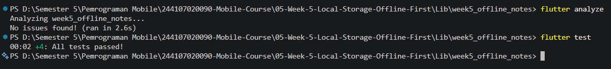
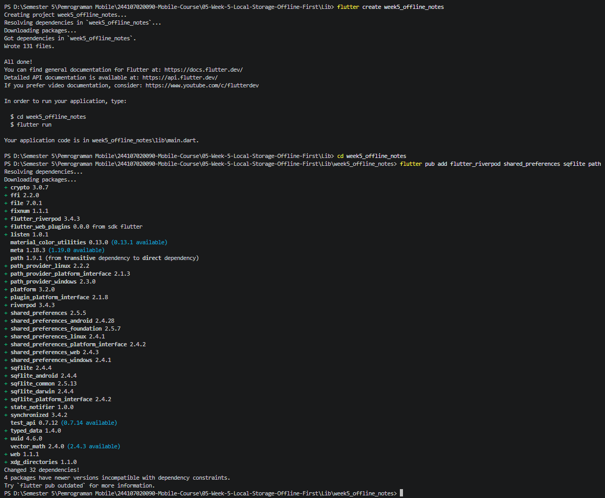
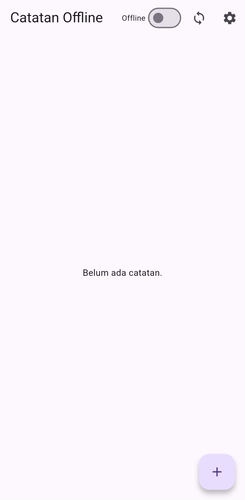
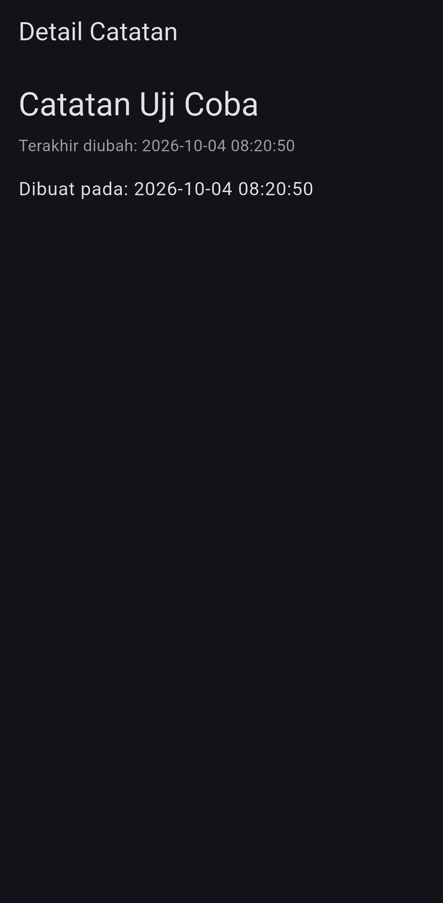
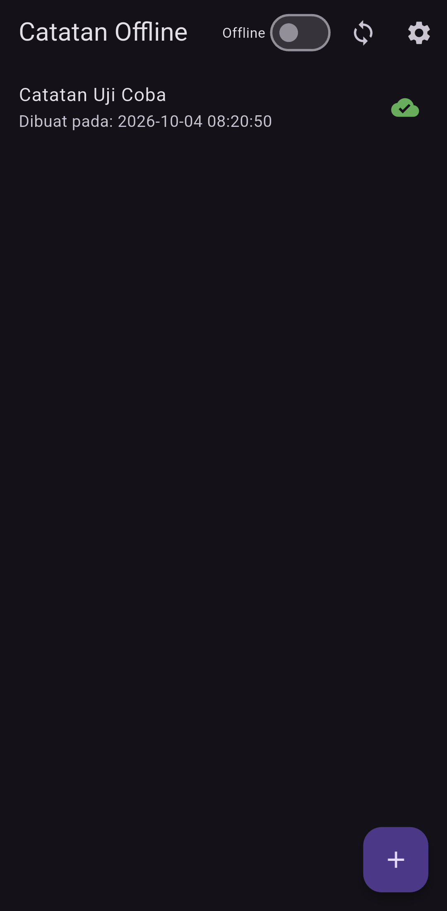
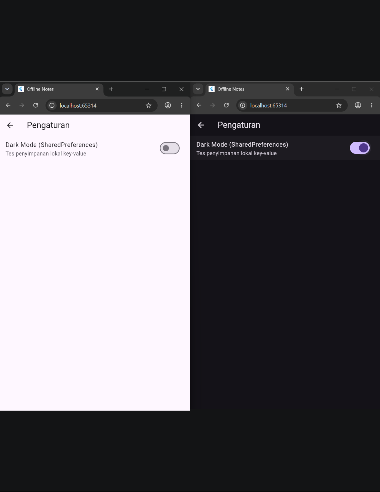
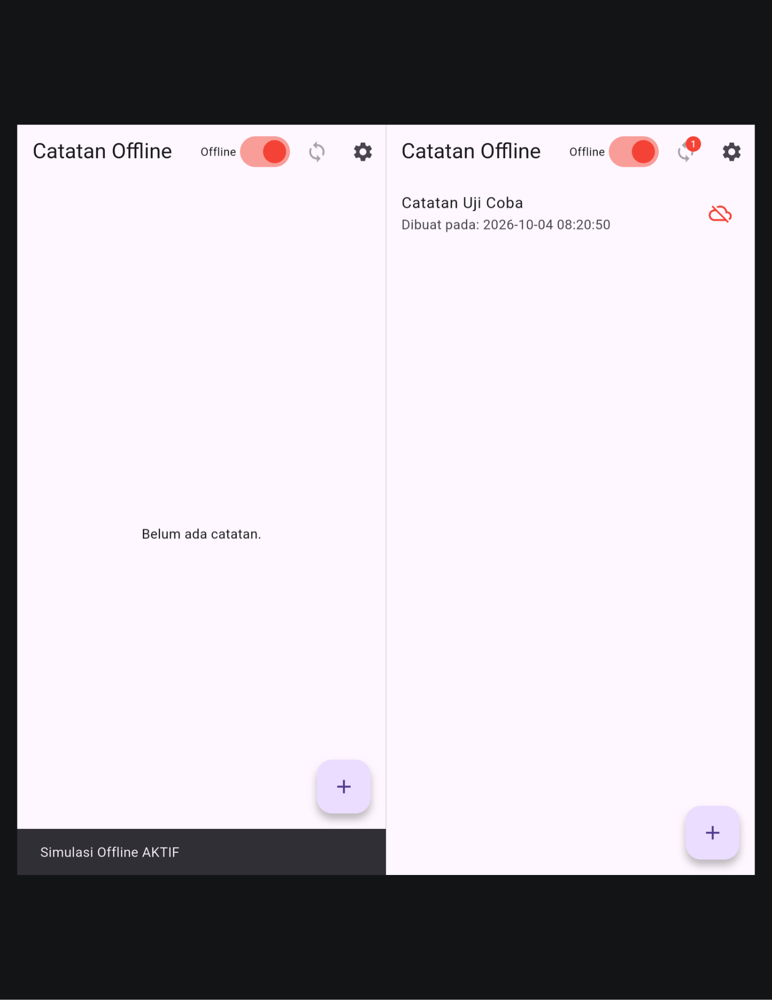
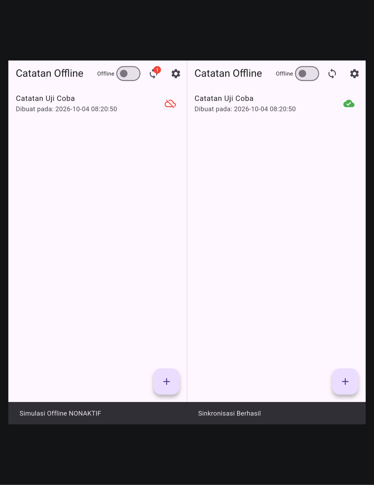

# Minggu 5 — Local Storage & Offline-First

> Dokumentasi Praktikum Mata Kuliah **Pemrograman Mobile**.

[](https://dart.dev/)
[](https://flutter.dev/)
[](https://pub.dev/packages/sqflite)
[](https://pub.dev/packages/shared_preferences)
[](https://riverpod.dev/)

## 🧭 Ringkasan

Minggu kelima membahas **penyimpanan lokal** dan strategi **Offline-First** pada aplikasi Flutter. Project praktikum adalah **Offline Notes**, sebuah aplikasi catatan yang menyimpan catatan pada SQLite lokal, menyimpan preferensi tema dengan SharedPreferences, menandai perubahan lokal dengan dirty flag, serta menyediakan simulasi sinkronisasi.

Materi juga membahas cache-first read untuk data remote, antrian sinkronisasi, strategi penyelesaian konflik **Last-Write-Wins (LWW)**, perbandingan teknologi penyimpanan lokal, refactoring widget/service, navigasi detail dengan GoRouter, dan pengujian menggunakan fake repository.

## 🎯 Tujuan Pembelajaran

Setelah menyelesaikan praktikum ini, saya diharapkan mampu:

1. Memilih media penyimpanan lokal sesuai bentuk dan volume data;
2. Menggunakan SharedPreferences untuk preferensi sederhana seperti tema;
3. Menggunakan SQLite melalui `sqflite` untuk menyimpan data terstruktur;
4. Memisahkan akses data lokal dari UI menggunakan repository dan provider;
5. Memahami strategi cache-first dan konsep Offline-First;
6. Menggunakan dirty flag sebagai penanda perubahan lokal yang belum disinkronkan;
7. Merancang alur sync queue serta memahami konflik data dengan LWW;
8. Mengelola navigasi ke detail data dengan GoRouter;
9. Menguji model, repository, dan provider dengan fake repository;
10. Memverifikasi project melalui `flutter analyze` dan `flutter test`.

## 🧰 Teknologi dan Tools

| Komponen | Penggunaan |
| --- | --- |
| **Dart** | Bahasa pemrograman aplikasi |
| **Flutter** | Framework UI lintas platform |
| **SharedPreferences** | Penyimpanan key-value sederhana untuk preferensi |
| **SQLite / sqflite** | Penyimpanan relasional lokal untuk catatan |
| **path** | Membentuk path database lintas platform |
| **Riverpod** | State management dan dependency injection |
| **Dio** | HTTP client untuk kebutuhan data remote |
| **GoRouter** | Navigasi ke pengaturan dan detail catatan |
| **flutter_test** | Pengujian unit dan widget |
| **Visual Studio Code** | Editor dan debugging |
| **Git** | Version control dan dokumentasi progres |

## 📂 Struktur Folder

```text
05-Week-5-Local-Storage-Offline-First/
├── README.md
├── Lib/
│   └── week5_offline_notes/
│       ├── lib/
│       │   ├── main.dart                         # ProviderScope, tema, dan konfigurasi GoRouter
│       │   ├── data/
│       │   │   ├── local/
│       │   │   │   ├── db.dart                    # Pembukaan DB dan pembuatan tabel
│       │   │   │   └── note.dart                  # Model Note dan konversi Map
│       │   │   ├── models/post.dart               # Model Post untuk data remote/cache
│       │   │   ├── prefs.dart                     # Repository preferensi SharedPreferences
│       │   │   ├── providers/note_provider.dart   # Provider daftar/detail note dan sync
│       │   │   ├── repositories/
│       │   │   │   ├── note_repository.dart       # CRUD/query SQLite dan dirty count
│       │   │   │   └── post_repository.dart       # Request dan cache post remote
│       │   │   └── services/sync_service.dart     # Simulasi sinkronisasi catatan dirty
│       │   ├── pages/
│       │   │   ├── notes_page.dart                # Daftar catatan dan kontrol offline/sync
│       │   │   ├── note_detail_page.dart          # Detail note berdasarkan ID lokal
│       │   │   └── settings_page.dart             # Pengaturan tema tersimpan
│       │   └── widgets/note_tile.dart             # Item list note dengan indikator dirty
│       ├── test/widget_test.dart                  # Fake repository, model, dan provider test
│       ├── pubspec.yaml                           # Metadata dan dependency
│       ├── analysis_options.yaml                  # Konfigurasi analyzer dan lint
│       ├── android/                               # Konfigurasi target Android
│       ├── ios/                                   # Konfigurasi target iOS
│       ├── linux/                                 # Konfigurasi target Linux
│       ├── macos/                                 # Konfigurasi target macOS
│       ├── web/                                   # Konfigurasi target web
│       └── windows/                               # Konfigurasi target Windows
├── Screenshots/                                   # Dokumentasi proses dan hasil aplikasi
└── Test/                                          # Bukti analyze dan test
```

## 🚀 Cara Menjalankan

### Persyaratan

- Git;
- Flutter SDK dan Dart SDK;
- Visual Studio Code dengan ekstensi Flutter dan Dart;
- Android Emulator atau perangkat Android untuk menjalankan SQLite melalui `sqflite`;
- Android SDK dan lisensi Android untuk target Android.

Verifikasi environment:

```bash
flutter --version
flutter doctor -v
flutter devices
```

Jika menggunakan Android, selesaikan lisensi SDK:

```bash
flutter doctor --android-licenses
```

Untuk perangkat fisik Android, aktifkan **Developer options** dan **USB debugging**, sambungkan perangkat dengan kabel USB, izinkan debugging, lalu pastikan perangkat terdeteksi melalui `flutter devices`.

> Aplikasi ini menggunakan `sqflite`, yang secara default ditujukan untuk platform native. Jalankan pada Android Emulator atau perangkat Android. Target web tidak tersedia langsung dari konfigurasi dependency SQLite yang digunakan project ini.

### Menjalankan aplikasi

```bash
git clone https://github.com/FadhilTaufiqurrachman/244107020090-Mobile-Course.git
cd 244107020090-Mobile-Course/05-Week-5-Local-Storage-Offline-First/Lib/week5_offline_notes
flutter pub get
flutter devices
flutter run -d <device-id>
```

Ganti `<device-id>` dengan ID emulator/perangkat yang ditampilkan oleh `flutter devices`. Contoh:

```bash
flutter run -d emulator-5554
```

Jika hanya satu target tersedia, perintah berikut juga dapat digunakan:

```bash
flutter run
```

### Menjalankan analisis dan test

Jalankan dari direktori project `Lib/week5_offline_notes`:

```bash
flutter analyze
flutter test
```

## 💾 Perbandingan Teknologi Penyimpanan Lokal

| Solusi | Jenis data | Kelebihan | Keterbatasan | Rule of thumb |
| --- | --- | --- | --- | --- |
| **SharedPreferences** | Key-value sederhana: String, int, bool, double | Ringan, mudah dipakai untuk nilai kecil | Tidak cocok untuk data terstruktur/relasional; bukan database query | Preferensi seperti tema, pengaturan UI, atau status sederhana |
| **SQLite (`sqflite`)** | Data relasional berupa tabel, kolom, dan foreign key | Stabil, query fleksibel, transaksi ACID | SQL dan boilerplate ditulis manual; type-safety tidak otomatis | Data terstruktur dan query yang lebih kompleks |
| **Hive** | Key-value/object store NoSQL | Cepat, API sederhana, tidak memerlukan SQL | Query dan relasi lebih terbatas | Cache object sederhana tanpa relasi kompleks |
| **Drift** | Relasional, dibangun di atas SQLite | Query type-safe, stream reaktif, dukungan migration | Memerlukan code generation dan setup lebih banyak | Aplikasi menengah/besar yang memerlukan query terstruktur dan reactive stream |

Pada project ini, pembagian tanggung jawab yang dipilih adalah SharedPreferences untuk preferensi tema dan SQLite untuk catatan. Menyimpan koleksi catatan yang besar sebagai satu string JSON di SharedPreferences tidak disarankan.

## 📴 Konsep Offline-First

Offline-First membuat aplikasi tetap dapat digunakan tanpa koneksi internet. Database lokal menjadi **primary source of truth** untuk UI; server digunakan untuk memperbarui atau menerima perubahan ketika tersedia.

### Cache-first read

Alur cache-first yang dituju pada praktikum:

1. Aplikasi membaca cache/data lokal terlebih dahulu;
2. Data lokal langsung ditampilkan agar UI cepat dan tetap tersedia offline;
3. Request remote dilakukan secara asynchronous di latar belakang;
4. Jika berhasil, cache lokal diperbarui;
5. Jika gagal karena offline, data lokal tetap dapat digunakan.

### Dirty flag dan antrean sinkronisasi

Setiap note memiliki properti `dirty` yang dipetakan ke kolom SQLite `dirty`:

| Nilai | Arti |
| --- | --- |
| `dirty = 1` / `true` | Perubahan lokal belum disinkronkan |
| `dirty = 0` / `false` | Data dianggap sudah tersinkron |

Secara konseptual, sync queue melakukan langkah berikut:

1. Mengambil record yang memiliki `dirty = 1`;
2. Mengirim record ke API, sendiri-sendiri atau secara batch;
3. Menunggu respons sukses dari server;
4. Mengubah flag menjadi `dirty = 0` setelah konfirmasi.

### Konflik dan Last-Write-Wins

Perubahan pada perangkat yang berbeda dapat menyebabkan data lokal dan remote berkonflik. Strategi **Last-Write-Wins (LWW)** membandingkan `updated_at` dalam format ISO-8601 UTC dan mempertahankan data dengan timestamp paling baru.

> Skema laporan jobsheet menggunakan ilustrasi tabel `notes` dengan `title`, `body`, `updated_at`, dan `dirty`. Source project yang tersedia membuat kolom `title`, `body`, `updated_at`, serta `dirty` dengan primary key integer auto-increment. Skema aktual project dirinci pada bagian SQLite di bawah.

## 🗝️ SharedPreferences untuk Preferensi

`lib/data/prefs.dart` membungkus akses SharedPreferences ke dalam `PrefsRepository`. Repository menyediakan operasi untuk:

- membaca dan menyimpan pilihan dark mode;
- mencatat waktu aplikasi terakhir dibuka;
- membaca waktu terakhir dibuka.

Contoh key yang digunakan:

```dart
static const _darkModeKey = 'dark_mode';
static const _lastOpenedKey = 'last_opened_at';
```

`SettingsPage` menggunakan `DarkModeNotifier` dan `darkModeProvider` untuk memuat serta menyimpan pilihan tema. Pembacaan SharedPreferences dilakukan secara asynchronous melalui provider, bukan langsung pada setiap pemanggilan `build()`.

### Mengapa SharedPreferences tidak digunakan untuk daftar catatan?

SharedPreferences ditujukan bagi preferensi kecil. Jika ribuan note diserialisasi ke satu string JSON, setiap perubahan kecil memerlukan serialisasi/penulisan koleksi secara besar, membuat I/O tidak efisien, dan meningkatkan risiko seluruh data menjadi rusak jika penulisan terganggu. Data berstruktur lebih sesuai dikelola oleh SQLite.

## 🗄️ SQLite dan Repository Catatan

### Database Helper

`lib/data/local/db.dart` membuka database `offline_notes.db` pada direktori database perangkat. Saat database dibuat, helper menyiapkan tabel:

```sql
CREATE TABLE notes(
  id INTEGER PRIMARY KEY AUTOINCREMENT,
  title TEXT NOT NULL,
  body TEXT NOT NULL DEFAULT '',
  updated_at TEXT NOT NULL,
  dirty INTEGER NOT NULL DEFAULT 0
);
```

Tabel `cached_posts` juga dibuat untuk menyimpan payload post JSON beserta waktu cache:

```sql
CREATE TABLE cached_posts(
  id INTEGER PRIMARY KEY,
  payload TEXT NOT NULL,
  cached_at TEXT NOT NULL
);
```

### Model `Note`

Model `Note` memiliki field:

| Field | Tipe | Keterangan |
| --- | --- | --- |
| `id` | `int?` | ID auto-increment dari SQLite |
| `title` | `String` | Judul catatan |
| `body` | `String` | Isi catatan, default kosong |
| `updatedAt` | `DateTime` | Waktu perubahan, disimpan sebagai ISO-8601 |
| `dirty` | `bool` | Penanda perubahan belum tersinkron |

`toMap()` mengubah model ke bentuk map untuk SQLite. `fromMap()` melakukan pembacaan kembali dan menyediakan default aman untuk field yang hilang. Dirty boolean disimpan sebagai integer `1` atau `0`.

### NoteRepository

`NoteRepository` memisahkan operasi database dari UI dan menyediakan:

- `fetchNotes()` untuk mengambil note dengan urutan terbaru;
- `getNoteById(id)` untuk mengambil detail satu note;
- `addNote(...)` untuk memasukkan note baru dan menandainya dirty;
- `deleteNote(id)` untuk menghapus note;
- `countDirty()` untuk menghitung note yang menunggu sync;
- `markAllSynced()` untuk mengubah seluruh dirty note menjadi tersinkron.

Database dapat diinjeksi melalui parameter `openDb`, sehingga repository bisa diganti dengan fake pada pengujian.

## 🔁 Riverpod, Status Offline, dan Sync

`note_provider.dart` menyediakan:

- `noteRepositoryProvider` untuk repository SQLite;
- `forceOfflineProvider` sebagai switch simulasi mode offline;
- `noteListProvider` untuk state asynchronous daftar note;
- `dirtyCountProvider` untuk menghitung catatan belum tersinkron;
- `noteDetailProvider(id)` untuk query note berdasarkan ID.

`NoteListNotifier.addNote()` menyimpan note melalui repository, kemudian memuat ulang daftar. `syncData()` menolak proses saat force-offline aktif. Jika tidak, method meneruskan sync ke `SyncService` dan membaca ulang data lokal.

Pada UI, badge menampilkan jumlah dirty notes dan ikon cloud-off pada item memberi tanda catatan belum tersinkron. Tombol sync dinonaktifkan ketika switch **Offline** aktif.

### Batas simulasi sync dalam source saat ini

`SyncService.syncNotes()` memeriksa dirty count, menunggu satu detik, lalu menjalankan `markAllSynced()`. Source saat ini tidak mengirim request catatan ke endpoint API dan tidak mendeteksi konektivitas perangkat secara otomatis. Switch offline hanya mengatur `forceOfflineProvider` untuk simulasi. Karena itu hasil sync dalam project ini adalah simulasi alur lokal, bukan bukti sinkronisasi server sesungguhnya.

## 🌐 Cache-First untuk Data Remote

`lib/data/repositories/post_repository.dart` menyediakan fungsi `loadPostsCacheFirst()` yang:

1. Membaca post dari tabel `cached_posts`;
2. Memulai `refreshPostsInBackground()`;
3. Mengembalikan cache yang tersedia agar pemanggil dapat menampilkan data lebih dahulu.

`refreshPostsInBackground()` mengambil `/posts` melalui Dio dan menyimpan JSON ke SQLite dengan `ConflictAlgorithm.replace`. Jika request gagal, exception ditangkap sehingga kegagalan jaringan tidak menghentikan aplikasi.

**Batas integrasi:** `PostRepository` tersedia dalam source, tetapi belum dibuat provider/injeksi dan belum digunakan oleh halaman aplikasi. Alur UI utama pada source yang ada adalah catatan lokal. Artinya cache-first post merupakan implementasi repository yang belum dihubungkan ke tampilan Offline Notes.

## 🧭 Navigasi dan Refactoring

`main.dart` membungkus aplikasi dengan `ProviderScope` dan mengonfigurasi route GoRouter:

| Route | Halaman |
| --- | --- |
| `/` | `NotesPage` |
| `/settings` | `SettingsPage` |
| `/note/:id` | `NoteDetailPage` |

Navigasi dari daftar ke detail menggunakan `context.push('/note/${note.id}')` agar riwayat navigasi dipertahankan. Halaman detail membaca note kembali dari SQLite melalui `noteDetailProvider(noteId)`.

Refactoring yang tersedia:

1. `NoteTile` dipisahkan menjadi widget reusable dan menampilkan ikon cloud-off saat dirty;
2. `SyncService` memisahkan simulasi sync dari operasi CRUD repository;
3. `NoteDetailPage` memuat data berdasarkan ID dari sumber lokal;
4. Provider dan repository memisahkan state serta I/O dari widget UI.

## 🧪 Testing dan Verifikasi

`test/widget_test.dart` menguji model, serialisasi dirty flag, serta provider dengan `FakeNoteRepository`. Fake tersebut sengaja tidak membuka SQLite sungguhan, sehingga test berjalan terisolasi dari I/O perangkat.

Skenario pengujian pada file meliputi:

- `Note.fromMap()` tetap aman ketika field tertentu hilang;
- flag `dirty` bertahan saat object dikonversi ke Map lalu dibuat kembali;
- provider mengembalikan catatan dari repository palsu;
- provider berubah menjadi error saat fake repository melempar exception.

Verifikasi project dapat dilakukan dengan:

```bash
flutter analyze
flutter test
```

Screenshot hasil analyze dan test pada folder `Test/` merupakan dokumentasi hasil praktikum. Perintah di atas tetap dapat dijalankan ulang secara lokal sesuai versi Flutter yang terpasang.



## 🧠 AI Challenge — Pemilihan Storage

Perbandingan solusi untuk aplikasi Offline Notes:

- **SharedPreferences:** sederhana dan sesuai untuk preferensi, tetapi tidak cocok untuk daftar note besar;
- **Hive:** cepat untuk object/cache sederhana, namun query dan relasi lebih terbatas;
- **sqflite:** stabil dan fleksibel untuk data relasional, dengan konsekuensi query SQL ditulis manual;
- **Drift:** type-safe dan mendukung stream reaktif, namun memerlukan code generation dan setup lebih berat.

### Keputusan teknis

Kombinasi **SharedPreferences + sqflite** dipilih karena:

1. Preferensi tema terpisah dari data catatan;
2. SQLite dapat melakukan query dirty records dengan `WHERE dirty = 1`;
3. Solusinya matang dan tidak memerlukan setup code generation tambahan pada tahap praktikum;
4. UI dapat tetap membaca data catatan dari penyimpanan lokal.

Rekomendasi AI diverifikasi dengan memastikan data terstruktur tidak ditempatkan di SharedPreferences, skema memiliki dirty flag dan timestamp, dan perbedaan reactive stream serta query antar solusi dipahami.

## 🖼️ Dokumentasi Screenshots

Seluruh screenshot yang tersedia dalam folder `Screenshots/` dan `Test/` dicantumkan berikut.

| Dokumentasi | Bukti |
| --- | --- |
| Pembuatan project Flutter |  |
| Aplikasi Offline Notes |  |
| Detail catatan |  |
| Dark theme pada Offline Notes |  |
| Pengujian tema |  |
| Note dirty ketika offline/belum sync |  |
| Kondisi setelah kembali online dan sync |  |
| Hasil analyze dan test |  |

## 📝 Refleksi

### 1. Mengapa daftar catatan tidak boleh disimpan di SharedPreferences? Apa yang rusak jika aturan ini dilanggar?

SharedPreferences dirancang untuk pasangan key-value kecil, seperti pilihan tema atau token sederhana, bukan untuk koleksi catatan terstruktur. Jika ribuan note disimpan sebagai satu string JSON, setiap perubahan kecil mengharuskan seluruh koleksi diserialisasi dan ditulis kembali. Hal ini tidak efisien, dapat menimbulkan jeda I/O, sulit melakukan query/filter, dan berisiko membuat seluruh string data rusak jika penulisan terputus. SQLite lebih sesuai karena mendukung tabel, query, transaksi, dan pembacaan data secara selektif.

### 2. Kapan strategi cache-first cukup, dan kapan membutuhkan strategi lain seperti network-first?

Cache-first cocok ketika aplikasi mengutamakan kecepatan baca dan ketersediaan data, sementara keterlambatan pembaruan beberapa saat masih dapat diterima, seperti catatan pribadi atau artikel. Aplikasi dapat menampilkan cache dengan cepat lalu memperbaruinya di latar belakang. Network-first lebih tepat untuk data sensitif waktu yang harus sesegar mungkin, misalnya saldo rekening, harga pasar real-time, atau ketersediaan tiket. Pada kasus itu, data lama dapat lebih berbahaya daripada menampilkan pesan bahwa jaringan tidak tersedia.

### 3. Bagaimana dirty flag berubah menjadi antrean sync tanpa memblokir UI? Kapan tabel outbox terpisah diperlukan?

Dirty flag menandai record lokal yang menunggu dikirim. Service dapat menjalankan query seperti `SELECT * FROM notes WHERE dirty = 1`, lalu mengirim data secara asynchronous di luar operasi render UI. Setelah server mengonfirmasi keberhasilan, repository memperbarui flag menjadi `0`. Untuk aplikasi sederhana, flag pada tabel utama dapat mencukupi. Tabel outbox terpisah lebih tepat jika sync melibatkan banyak jenis entitas, harus menjaga urutan operasi, menyimpan retry count, mengelola penghapusan, atau memerlukan audit atas setiap request yang belum berhasil.

### 4. Bagian mana dari rekomendasi AI yang ditolak, dan mengapa?

Rekomendasi untuk menaruh daftar catatan terstruktur ke SharedPreferences ditolak karena penyimpanan tersebut tidak dirancang untuk kumpulan data besar, query, dan relasi. Hive dan Drift memiliki keunggulan masing-masing, tetapi untuk lingkup praktikum ini kombinasi SharedPreferences dan sqflite dipilih agar preferensi kecil tetap sederhana, sedangkan data catatan dikelola relasional. Keputusan tersebut juga menghindari penambahan code generation yang tidak diperlukan untuk tujuan pembelajaran saat ini. Rekomendasi AI tetap harus ditinjau terhadap kebutuhan, trade-off, dan kondisi project, bukan diterapkan begitu saja.

### 5. Apa pembelajaran utama dari praktikum Local Storage & Offline-First?

Pembelajaran utama adalah memilih storage berdasarkan bentuk data dan membangun alur agar UI tidak bergantung langsung pada jaringan. Preferensi sederhana cocok di SharedPreferences, sedangkan catatan terstruktur lebih tepat di SQLite. Repository dan provider menjaga pemisahan tanggung jawab, dirty flag membantu melacak perubahan lokal, dan sinkronisasi harus menangani kegagalan serta konflik dengan hati-hati. Demo sync pada project ini masih simulasi, sehingga integrasi API, pemantauan konektivitas, retry queue persisten, dan LWW nyata menjadi langkah pengembangan berikutnya.

## 💡 Kesimpulan

Week 5 memperkenalkan fondasi aplikasi yang tetap berguna ketika offline: penyimpanan lokal sebagai sumber data UI, SharedPreferences untuk preferensi, SQLite untuk data relasional, dirty flag untuk menandai perubahan, dan service/provider sebagai pemisah logika dari tampilan. Cache-first, sync queue, dan LWW menjadi pola penting untuk aplikasi produksi. Implementasi repository ini sudah memperlihatkan struktur dasar Offline Notes beserta tema, detail lokal, dan simulasi sync; sinkronisasi remote serta beberapa operasi CRUD masih dapat dikembangkan lebih lanjut.

## 🔗 Referensi

- [Flutter cookbook — persistence](https://docs.flutter.dev/cookbook/persistence)
- [shared_preferences package](https://pub.dev/packages/shared_preferences)
- [sqflite package](https://pub.dev/packages/sqflite)
- [SQLite documentation](https://www.sqlite.org/docs.html)
- [Riverpod documentation](https://riverpod.dev/)
- [GoRouter package](https://pub.dev/packages/go_router)
- [Dio package](https://pub.dev/packages/dio)
- [Flutter testing documentation](https://docs.flutter.dev/testing)
- [Dart language documentation](https://dart.dev/language)

---

📌 **Repository:** [244107020090-Mobile-Course](https://github.com/FadhilTaufiqurrachman/244107020090-Mobile-Course)

👨‍💻 **Mahasiswa:** Fadhil Taufiqurrachman · **NIM:** 244107020090